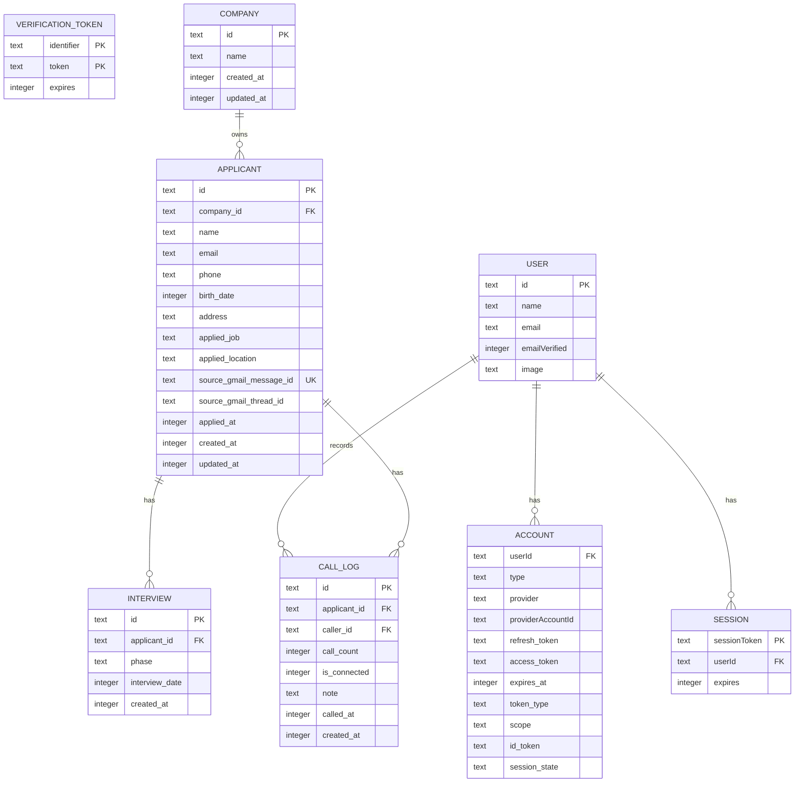

# RPOアプリ データベース設計書

## 1. 設計対象
- DB: Cloudflare D1（SQLite）
- ORM: Drizzle ORM
- 主用途: 応募者管理、選考進捗（歩留まり）管理、架電ログ管理、認証補助データ管理

## 2. ER図


## 3. テーブル概要
| テーブル | 役割 | 主キー | 主要外部キー |
|---|---|---|---|
| `user` | ログインユーザー情報 | `id` | - |
| `account` | OAuthプロバイダ連携情報 | `(provider, providerAccountId)` | `userId -> user.id` |
| `session` | セッション（スキーマ定義済み） | `sessionToken` | `userId -> user.id` |
| `verificationToken` | 認証トークン | `(identifier, token)` | - |
| `company` | 企業マスタ | `id` | - |
| `applicant` | 応募者・選考進捗・応募元情報 | `id` | `company_id -> company.id` |
| `interview` | 面接イベント | `id` | `applicant_id -> applicant.id` |
| `call_log` | 架電履歴 | `id` | `applicant_id -> applicant.id`, `caller_id -> user.id` |

## 4. `applicant` のステータス列設計
- 歩留まりフラグは `integer(mode:boolean)` で保持（0/1集計しやすい設計）
- 主なフラグ群:
  - 書類/応募: `is_unique_applicant`, `is_valid_applicant`, `doc_declined`, `doc_rejected_mk`, `doc_rejected_client`
  - 1次面接: `primary_*`
  - 2次面接: `sec_*`
  - 最終面接: `final_*`
  - 結果: `offered`, `offer_declined`, `joined`
- 日付列は `*_date` / `applied_at` / `created_at` / `updated_at` を使用

## 5. 制約・整合性
- 参照整合:
  - `company -> applicant`
  - `applicant -> interview`
  - `applicant -> call_log`
  - `user -> call_log`
  - すべて `ON DELETE CASCADE`
- 重複取り込み防止:
  - `applicant.source_gmail_message_id` に `UNIQUE INDEX`
- タイムスタンプ:
  - 多くの `created_at` / `updated_at` / `called_at` は `strftime('%s','now')` デフォルト

## 6. 現状インデックスと改善推奨
### 現状
- `PRIMARY KEY` 各種
- `applicant_source_gmail_message_id_unique`

### 推奨（性能改善）
```sql
CREATE INDEX idx_applicant_company_created ON applicant(company_id, created_at DESC);
CREATE INDEX idx_applicant_applied_at ON applicant(applied_at DESC);
CREATE INDEX idx_call_log_applicant_called_at ON call_log(applicant_id, called_at DESC);
CREATE INDEX idx_call_log_caller_called_at ON call_log(caller_id, called_at DESC);
CREATE INDEX idx_interview_applicant_date ON interview(applicant_id, interview_date DESC);
```

## 7. 運用上の注意
- `call_log.call_count` は「応募者ごと連番」をアプリ側で算出しているため、同時書き込み時の競合対策（トランザクション/再試行）を検討する。
- 企業名の正規化検索（`lower(trim(name))`）は件数増加時に負荷が上がるため、正規化済みカラム追加や検索用インデックス戦略を検討する。
