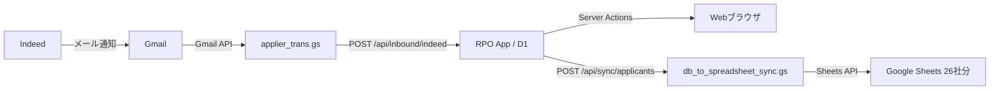

# RPO_24CS 要件定義書 v1

> **ドキュメント情報**
> - プロジェクト名: RPO_24CS（採用プロセス最適化システム）
> - 作成日: 2026-03-08
> - モード: 分析モード（既存コードからの逆引き＋改善提案）

---

## 1. 概要

### 1.1. 目的

RPO（Recruitment Process Outsourcing）業務を効率化するWebアプリケーション。
Indeed経由の求人応募を自動取込し、応募者の進捗管理・架電記録・歩留まり分析を一元的に行う。

### 1.2. 対象ユーザー

| ユーザー種別 | 人数 | 主な操作 |
|:---|:---|:---|
| RPOオペレーター | 約10名 | 応募者管理、架電登録、ステータス更新 |
| マネージャー | 1〜2名（上記に含む） | 歩留まり分析、CSV出力、企業管理 |

### 1.3. 背景

- 26社以上のクライアント企業の採用業務を代行している
- Indeed からのメール応募を手動でスプレッドシートに転記する運用が非効率だった
- 応募〜入社までの歩留まり（ファネル）を企業別・月別に可視化したいニーズがあった

> **なぜこうしたか？**
> 既存のGoogle Sheetsベースの運用をベースに、データの一元管理と自動化を段階的に導入するアプローチを採用しています。
> 全面的なSaaS移行ではなく、既存ワークフロー（Sheets + Gmail）との連携を維持しつつ、
> コアのデータ管理だけをWebアプリ化した点が設計のポイントです。

> **もっと学ぶなら:**
> - 「段階的システム移行（Strangler Fig Pattern）」で検索
> - Martin Fowler の「StranglerFigApplication」パターンが参考になります

---

## 2. スコープ

### 2.1. 対象範囲

| 機能領域 | 説明 |
|:---|:---|
| 応募者管理 | CRUD、一覧表示、詳細編集、ファネルステータス管理 |
| 架電ログ管理 | 架電登録、履歴表示、分析（接続率等） |
| 企業パフォーマンス | 歩留まり表示、月次集計、CSV出力 |
| データ連携 | Indeed メール→自動取込、DB→Google Sheets 同期 |
| 認証 | Google OAuth によるログイン・アクセス制御 |

### 2.2. 対象外

| 除外項目 | 理由 |
|:---|:---|
| 求人原稿の管理 | Indeed側で管理されるため |
| 請求・課金管理 | 別システムで管理 |
| 応募者への自動メール送信 | 現時点で要件なし |
| モバイル専用UI | デスクトップ利用が主（レスポンシブ対応のみ） |

---

## 3. 機能要件

### 3.1. 認証・認可

| 機能 | 優先度 | 実装状況 | 備考 |
|:---|:---|:---|:---|
| Google OAuthログイン | 必須 | **実装済み** | NextAuth.js 5 + JWT |
| ホワイトリストによるアクセス制御 | 必須 | **実装済み** | 環境変数 `ALLOWED_LOGIN_LIST` |
| 管理者権限の分離 | 推奨 | **部分的** | `isAdminUser()` ロジックに不具合あり（レビュー#2） |
| セッション管理 | 必須 | **実装済み** | JWT cookie、ミドルウェアで保護 |

> **改善提案:**
> `isAdminUser()` のデフォルト値を `false`（Deny by Default）に修正すべきです。
> 現状、環境変数未設定時に全ユーザーが管理者扱いになるリスクがあります。
> また、Server Actions内にも認証チェックを追加し、多層防御（Defense in Depth）を実現してください。

> **もっと学ぶなら:**
> - 「OWASP Authentication Cheat Sheet」で検索
> - 「Principle of Least Privilege（最小権限の原則）」

---

### 3.2. 応募者管理

| 機能 | 優先度 | 実装状況 | 備考 |
|:---|:---|:---|:---|
| 応募者一覧表示 | 必須 | **実装済み** | ページネーション（50件/ページ）、企業フィルタ、名前検索 |
| 応募者詳細表示・編集 | 必須 | **実装済み** | 全フィールドのインライン編集、オートセーブ |
| 応募者の新規登録 | 必須 | **実装済み** | 手動登録 + Indeed自動取込 |
| 応募者の削除 | 必須 | **実装済み** | 物理削除（論理削除なし） |
| ファネルステータス管理 | 必須 | **実装済み** | 28個のブールフラグで段階管理 |
| 担当者アサイン | 必須 | **実装済み** | ユーザー選択 + 担当者名の表示 |
| ふりがな検索 | 推奨 | **実装済み** | フリガナカラムでの検索対応 |
| 次回アクション管理 | 推奨 | **実装済み** | 日付 + 内容のメモ |

> **改善提案:**
> - **物理削除→論理削除への移行を検討:** 現在は `DELETE` で完全消去されるため、誤削除からの復旧が不可能です。`deleted_at` カラムによるソフトデリートの導入を推奨します。
> - **バリデーション強化:** `appliedAt`（応募日）が未来日でも登録可能な状態です。日付の妥当性チェックを追加してください。
> - **空白入力の制御:** `nextActionContent` が空白文字のみでも保存可能です。trim + 空文字チェックを追加してください。

> **もっと学ぶなら:**
> - 「Soft Delete パターン」で検索（論理削除 vs 物理削除のトレードオフ）
> - 「Form Validation Best Practices」

---

### 3.3. 架電ログ管理

| 機能 | 優先度 | 実装状況 | 備考 |
|:---|:---|:---|:---|
| 架電の登録 | 必須 | **実装済み** | 応募者選択、接続/不通、メモ |
| 架電履歴の一覧 | 必須 | **実装済み** | 日付・応募者でフィルタ可能 |
| 架電分析 | 推奨 | **実装済み** | 合計架電数、接続率、企業別集計 |
| 架電ログの削除 | 推奨 | **実装済み** | 個別削除 |

> **改善提案:**
> - `callLogs.called_at` にインデックスがないため、分析クエリのパフォーマンスが低下する可能性があります。インデックスの追加を推奨します。

---

### 3.4. 企業パフォーマンス

| 機能 | 優先度 | 実装状況 | 備考 |
|:---|:---|:---|:---|
| 企業別歩留まり表示 | 必須 | **実装済み** | 応募→有効→面接→内定→入社のファネル |
| 月次集計 | 必須 | **実装済み** | 企業×月の歩留まり推移 |
| CSV出力（歩留まり） | 必須 | **実装済み** | GET `/api/companies/yields/csv` |
| CSV出力（月次） | 必須 | **実装済み** | GET `/api/companies/monthly-yields/csv` |
| 企業の追加・削除 | 推奨 | **実装済み** | 管理画面から操作 |
| リアルタイム企業別応募者数 | 推奨 | **実装済み** | `/companies/anytime` |

> **改善提案:**
> - 企業コードのマッチングルールが `sync/applicants/route.ts` にハードコードされています。DB駆動の設定に移行し、コードデプロイなしで変更可能にすることを推奨します。

---

### 3.5. データ連携

| 機能 | 優先度 | 実装状況 | 備考 |
|:---|:---|:---|:---|
| Indeed メール自動取込 | 必須 | **実装済み** | GAS → Webhook (`/api/inbound/indeed`) |
| Gmail メッセージID重複排除 | 必須 | **実装済み** | `sourceGmailMessageId` で検知 |
| Google Sheets 同期 | 必須 | **実装済み** | GAS → 26社のスプレッドシートに出力 |
| 同期APIエンドポイント | 必須 | **実装済み** | `/api/sync/applicants` (ページネーション対応) |

> **改善提案:**
> - **APIキー検証の強化:** 現在の単純な文字列比較 (`===`) はタイミング攻撃に脆弱です。`crypto.timingSafeEqual()` の使用を推奨します。
> - **GAS Sheets書き込みの効率化:** 現在1レコードにつき3回の `setValues()` を呼び出しています。バッチ書き込みに変更することで、200レコードの処理が600回→3回のAPI呼び出しに削減できます。
> - **レート制限:** Webhookエンドポイントにレート制限がありません。悪意のある大量リクエストに対する防御を追加してください。

> **もっと学ぶなら:**
> - 「Timing Attack（タイミング攻撃）」で検索
> - 「Google Apps Script Best Practices - Batch Operations」

---

## 4. 非機能要件

### 4.1. 可用性

| 項目 | 目標 | 現状 | 備考 |
|:---|:---|:---|:---|
| サービス稼働率 | 99.5%以上 | Cloudflare Workers SLA依存 | エッジコンピューティングで高可用性 |
| 計画停止 | 最小限 | デプロイ時のみ（ゼロダウンタイム） | Cloudflareのローリングデプロイ |

### 4.2. 性能

| 項目 | 目標 | 現状 | 備考 |
|:---|:---|:---|:---|
| ページ表示速度 | 3秒以内 | 概ね達成 | Server Components活用 |
| 同時ユーザー数 | 10名 | 問題なし | Cloudflare Workers自動スケーリング |
| DB応答時間 | 500ms以内 | 概ね達成 | D1エッジDB |

> **改善提案:**
> - `applicants` テーブルの `assignee_user_id`, `response_status` にインデックスが不足しています。データ量の増加に伴いクエリパフォーマンスが低下する可能性があります。

### 4.3. セキュリティ

| 項目 | 目標 | 現状 | 備考 |
|:---|:---|:---|:---|
| 認証 | Google OAuth 2.0 | **実装済み** | NextAuth.js 5 |
| 認可 | ロールベースアクセス制御 | **部分的** | ホワイトリスト制御あり、管理者ロジックに不具合 |
| 通信暗号化 | HTTPS必須 | **実装済み** | Cloudflare自動SSL |
| APIキー認証 | Webhook保護 | **実装済み** | タイミング攻撃対策が未実施 |
| 監査ログ | データ変更の追跡 | **未実装** | 誰が何をいつ変更したかの記録なし |
| Server Actions保護 | 認証チェック | **未実装** | ミドルウェアのみに依存 |

> **改善提案:**
> - **監査ログの導入:** 最低限、applicant の作成・更新・削除を `audit_logs` テーブルに記録することを推奨します。個人情報を扱うシステムとして、誰がいつ何を変更したかの追跡は必須です。
> - **Server Actions全体への認証チェック追加:** ミドルウェアだけでなく、各Server Action内部でも `auth()` を呼び出して認証状態を検証してください。

> **もっと学ぶなら:**
> - 「OWASP Top 10」で検索（Webアプリケーションの代表的な脆弱性トップ10）
> - 「Audit Trail Design Pattern」

### 4.4. 保守性

| 項目 | 目標 | 現状 | 備考 |
|:---|:---|:---|:---|
| テスト | ユニットテスト + E2Eテスト | **未実装** | テストファイルがゼロ |
| CI/CD | 自動テスト + 自動デプロイ | **未整備** | GitHub Actions等なし |
| コード品質 | ESLint + TypeScript strict | **実装済み** | 厳格モード有効 |
| ドキュメント | 設計書 + APIドキュメント | **部分的** | 既存docs/あり、体系的な設計書なし |

> **改善提案:**
> - **テストの段階的導入:** まずユーティリティ関数（日付パース、年齢計算、企業名正規化）の単体テストから始め、次にServer Actions、最後にE2Eテストの順で導入してください。
> - **CI/CDの構築:** 最低限、`npm run lint` + `npm run typecheck` をPR時に自動実行するGitHub Actionsワークフローの導入を推奨します。

> **もっと学ぶなら:**
> - 「Testing Trophy（Kent C. Dodds）」— テスト戦略のバランスの考え方
> - 「GitHub Actions for Next.js」で検索

---

## 5. データ/ナレッジ設計（概要）

### 5.1. データモデル概要

| エンティティ | 説明 | レコード規模（想定） |
|:---|:---|:---|
| users | システムユーザー（オペレーター） | 〜10件 |
| companies | クライアント企業 | 〜30件 |
| applicants | 求人応募者 | 数千〜数万件/年 |
| callLogs | 架電記録 | 応募者数の数倍 |
| interviews | 面接記録 | 応募者の一部 |

### 5.2. データフロー

> **なぜこうしたか？**
> Indeed → Gmail → GAS → RPO API という間接的な経路を採用しているのは、
> Indeed が直接的なWebhook連携を提供していないためです。
> Gmail をバッファとして活用し、GASでメールをパースしてAPIに送信する構成は、
> Indeed の仕様変更に対してGAS側の修正だけで対応できる柔軟性があります。

---

## 6. 外部インターフェース

| 連携先 | 方向 | プロトコル | 認証 | 用途 |
|:---|:---|:---|:---|:---|
| Google OAuth | 双方向 | OAuth 2.0 | Client ID/Secret | ユーザー認証 |
| Gmail API | 受信 | REST API (GAS) | Script Properties | Indeedメール取得 |
| RPO Inbound API | 受信 | HTTPS POST | APIキー (Header) | Indeed応募データ取込 |
| RPO Sync API | 送信 | HTTPS POST | APIキー (Header) | Sheets同期用データ提供 |
| Google Sheets API | 送信 | REST API (GAS) | Script Properties | 26社スプレッドシート更新 |

---

## 7. 環境/構成

| 環境 | 構成 | 用途 |
|:---|:---|:---|
| 開発 | ローカル Next.js + better-sqlite3 | 開発・デバッグ |
| プレビュー | Vercel | PR レビュー |
| 本番 | Cloudflare Workers + D1 | プロダクション |

### 7.1. 必要な環境変数

| 変数名 | 用途 | 設定場所 |
|:---|:---|:---|
| `AUTH_SECRET` | NextAuth セッション暗号化 | Cloudflare Secrets |
| `AUTH_GOOGLE_ID` | Google OAuth Client ID | Cloudflare Secrets |
| `AUTH_GOOGLE_SECRET` | Google OAuth Client Secret | Cloudflare Secrets |
| `INBOUND_API_KEY` | Indeed Webhook 認証 | Cloudflare Secrets |
| `SYNC_API_KEY` | Sheets同期API 認証 | Cloudflare Secrets |
| `ALLOWED_LOGIN_LIST` | ログイン許可メールリスト | Cloudflare 環境変数 |
| `AUTH_URL` | NextAuth コールバックURL | Cloudflare 環境変数 |

---

## 8. スケジュール（参考）

本プロジェクトは既に稼働中のため、改善作業のロードマップとして記載する。

| フェーズ | 内容 | 優先度 |
|:---|:---|:---|
| Phase 1 | セキュリティ修正（認証チェック追加、isAdmin修正、APIキー検証強化） | 高 |
| Phase 2 | テスト基盤導入（ユーティリティ関数の単体テスト） | 高 |
| Phase 3 | DB改善（インデックス追加、監査ログテーブル導入） | 中 |
| Phase 4 | コード品質改善（DRY違反解消、コンポーネント分割） | 中 |
| Phase 5 | インフラ改善（CI/CD導入、設定のDB駆動化） | 中 |
| Phase 6 | GASスクリプト最適化（バッチ書き込み） | 低 |

---

## 9. 受入基準（UAT）目標

| 機能 | 受入基準 |
|:---|:---|
| ログイン | 許可リストのGoogleアカウントでのみログインできること |
| 応募者一覧 | 企業フィルタ・名前検索・ページネーションが正常に動作すること |
| 応募者編集 | 各フィールドの変更が即座にDBに反映され、一覧に戻ると最新値が表示されること |
| Indeed取込 | GASからのWebhookで応募者が自動登録され、重複が排除されること |
| 歩留まり表示 | 企業別の歩留まり率が正しく計算・表示されること |
| CSV出力 | ダウンロードしたCSVがExcelで正常に開けること（文字化けなし） |
| Sheets同期 | 26社のスプレッドシートにデータが正しく反映されること |

---

## 10. 運用/保守

| 項目 | 現状 | 改善後の姿 |
|:---|:---|:---|
| デプロイ | `npm run deploy` で手動実行 | GitHub Actions で main マージ時に自動デプロイ |
| 監視 | Cloudflare Observability（基本ログ） | エラー通知 + 監査ログ追加 |
| バックアップ | Cloudflare D1 自動バックアップ | 定期的なエクスポート追加を検討 |
| GAS監視 | 実行ログのみ | 失敗時のSlack/メール通知を追加 |

---

## 11. 前提/制約

| 項目 | 内容 |
|:---|:---|
| Indeed連携 | メール通知経由（直接API連携なし） |
| データベース | Cloudflare D1（SQLite）— JOIN性能やデータ型に制約あり |
| 認証 | Google Workspace アカウント必須 |
| ブラウザ | Chrome/Edge 最新版を推奨（デスクトップ中心） |
| チーム規模 | 最大10名程度 |

---

## 12. リスク/対応

| リスク | 影響度 | 発生可能性 | 対応策 |
|:---|:---|:---|:---|
| Indeed メール形式の変更 | 高 | 中 | GASパーサーの正規表現を更新。パース失敗をラベルで検知。 |
| D1 のデータ量上限 | 中 | 低 | Cloudflare D1 は 10GB まで。年間数万レコードなら十分。 |
| Google OAuth の障害 | 高 | 低 | Cloudflare のキャッシュ + JWT でセッション維持。 |
| Server Actionsの認証バイパス | 高 | 中 | **要対応:** 全Server Actionsに認証チェックを追加する。 |
| 監査ログ不在による調査不能 | 中 | 中 | **要対応:** audit_logs テーブルの導入。 |

---

## 13. 変更管理

| 項目 | 方針 |
|:---|:---|
| バージョン管理 | Git（GitHub） |
| ブランチ戦略 | main ブランチ直接運用（現状）→ feature ブランチ運用への移行を推奨 |
| コードレビュー | 未実施（現状）→ PR ベースのレビュー導入を推奨 |
| マイグレーション | Drizzle Kit によるスキーマ変更管理（前方互換のみ） |

---

## 14. 添付/参照

| ドキュメント | パス |
|:---|:---|
| DB設計メモ | `my-project/docs/database-design.md` |
| システム構成メモ | `my-project/docs/system-architecture.md` |
| 設計判断ログ | `my-project/docs/DESIGN.md` |
| GASセットアップ手順 | `my-project/docs/gas-inbound-setup.md` |
| UI改善方針 | `UI修正方針.txt` |
| 学習カリキュラム | `新規.md` |
| コードレビューレポート | `docs/rpo_24cs_code_review_v1.md`（本分析で作成予定） |
