# RPO_24CS 仕様書 v1

> **ドキュメント情報**
> - プロジェクト名: RPO_24CS（採用プロセス最適化システム）
> - 作成日: 2026-03-08
> - モード: 分析モード（現状の実装を文書化＋改善後の理想仕様を併記）
> - 関連ドキュメント: 要件定義書 (`rpo_24cs_requirements_v1.md`)、技術選定評価書 (`rpo_24cs_tech_evaluation_v1.md`)、DB設計書 (`rpo_24cs_database_design_v1.md`)

---

## 1. はじめに

### 1.1. 目的

本書は RPO_24CS の現状の実装を正確に文書化し、コードレビューで発見された改善点を踏まえた改善後の理想仕様を併記するものである。

### 1.2. 対象読者

- 開発者（機能追加・バグ修正時の参照）
- 運用担当者（障害対応・定常運用の手順確認）
- プロジェクト管理者（仕様の把握・改善計画の立案）

### 1.3. 関連ドキュメント

| ドキュメント | パス | 用途 |
|:---|:---|:---|
| 要件定義書 | `docs/rpo_24cs_requirements_v1.md` | 要件の全体像 |
| 技術選定評価書 | `docs/rpo_24cs_tech_evaluation_v1.md` | 技術スタックの評価 |
| DB設計書 | `docs/rpo_24cs_database_design_v1.md` | テーブル定義・ER図 |
| コードレビューレポート | `docs/rpo_24cs_code_review_v1.md` | 発見事項・改善提案 |
| 設計判断ログ | `my-project/docs/DESIGN.md` | 過去の設計判断記録 |
| GASセットアップ手順 | `my-project/docs/gas-inbound-setup.md` | GAS連携の構築手順 |

---

## 2. システム概要

### 2.1. システム目的

Indeed経由の求人応募を自動取込し、26社以上のクライアント企業の応募者管理・架電記録・歩留まり分析を一元化するRPO業務支援システム。

### 2.2. システムスコープ

**スコープ内:**
- 応募者のCRUD・ファネルステータス管理
- 架電ログの登録・履歴・分析
- 企業別歩留まり・月次集計・CSV出力
- Indeed メール自動取込（GAS → Webhook）
- Google Sheets 同期（GAS → 26社分）
- Google OAuth 認証・ホワイトリスト制御

**スコープ外:**
- 求人原稿管理、請求・課金、応募者への自動メール送信、モバイル専用UI

### 2.3. 現状のシステム構成図

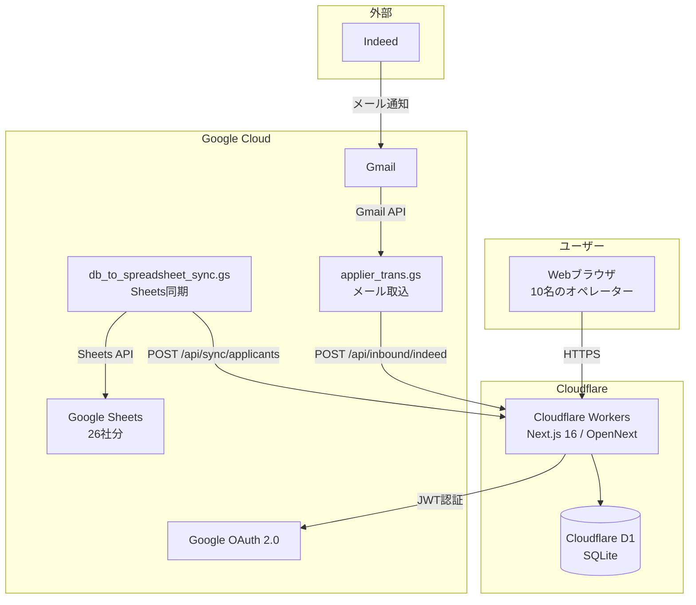

### 2.4. 改善後のシステム構成図（提案）

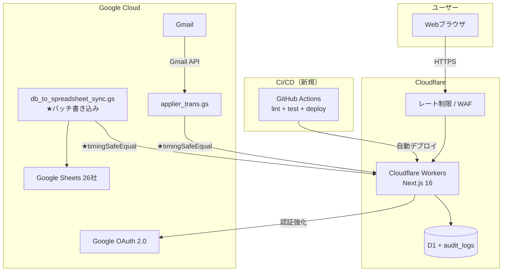

**改善後の主な変更点:**
- レート制限の追加（Cloudflare WAF）
- Server Actions内の認証チェック追加
- APIキー検証の強化（timingSafeEqual）
- 監査ログテーブルの導入
- CI/CDパイプラインの構築
- GAS Sheets書き込みのバッチ最適化

### 2.5. 主要シーケンス図

#### Indeed応募取込フロー

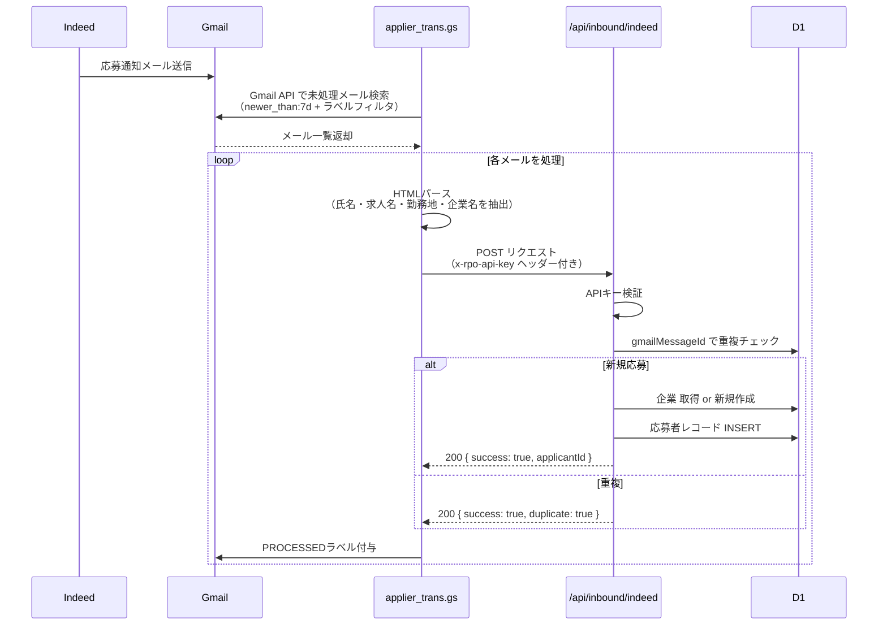

#### 応募者編集フロー

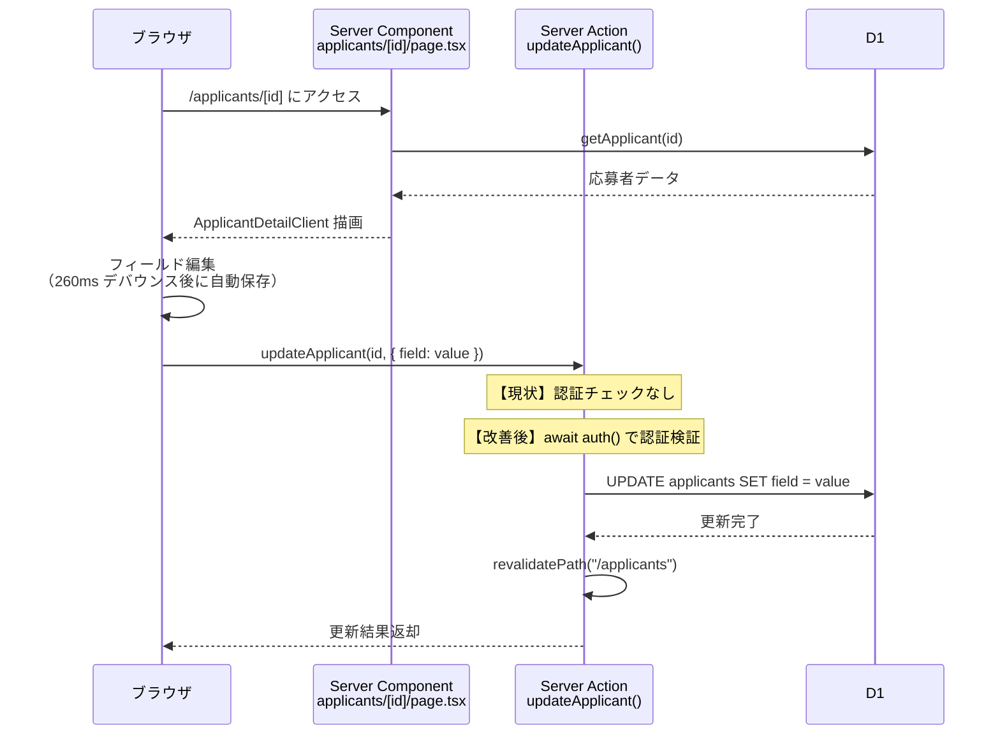

#### 歩留まり分析フロー

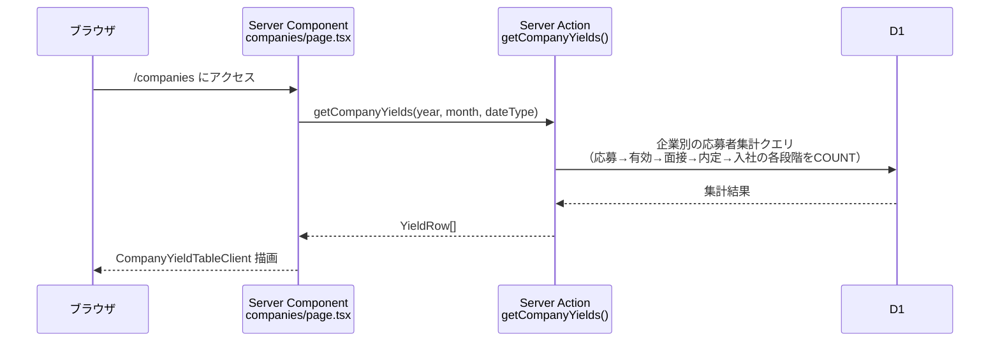

---

## 3. 機能仕様

### 3.1. 認証・ログイン

#### 3.1.1. 機能概要

Google OAuth 2.0 によるシングルサインオン。ホワイトリスト方式でログイン可能なユーザーを制限する。

#### 3.1.2. 入出力仕様

| 項目 | 入力 | 出力 |
|:---|:---|:---|
| ログイン画面表示 | `callbackUrl?` (searchParams) | ログインUI（Google ボタン） |
| Google OAuth コールバック | Google ID Token | JWT セッションCookie |
| ログイン判定 | メールアドレス | 許可 / 拒否 |

#### 3.1.3. 処理仕様

**現状の実装:**
1. `/login` にアクセス → セッション確認 → 既にログイン済みならリダイレクト
2. `callbackUrl` をサニタイズ（`/` 始まりのみ許可、デフォルト `/applicants`）
3. Google ボタンクリック → NextAuth.js が Google OAuth フローを開始
4. コールバック受信 → `signIn` callback で以下を検証:
   - プロバイダが Google であること
   - メールアドレスがホワイトリストに含まれること
5. JWT トークン生成 → `userId` をトークンに格納
6. セッション Cookie 設定 → ダッシュボードにリダイレクト

**ホワイトリスト判定ロジック:**
- `ALLOWED_LOGIN_LIST` が空 → 全 Google ユーザーを許可
- 完全一致: `user@example.com` → そのメールのみ許可
- ドメイン一致: `@example.com` → そのドメインの全ユーザーを許可

#### 3.1.4. ミドルウェアによるルート保護

**保護対象:** `/applicants/*`, `/companies/*`, `/calls/*`

**処理:** `req.auth?.user` が存在しない場合、`/login?callbackUrl={元のパス}` にリダイレクト

> **設計判断メモ:**
> JWT戦略を採用したのは、Cloudflare Workers がステートレスなエッジ環境であり、
> サーバーサイドセッションストア（Redis等）を持てないためです。
> JWTならCookie内に完結し、外部ストレージ不要でセッション管理できます。

> **改善提案:**
> - Server Actions内にも `await auth()` チェックを追加し、多層防御を実現する
> - `isAdminUser()` のデフォルト値を `false` に修正する

> **もっと学ぶなら:**
> - 「JWT vs Session — どちらを選ぶか」で検索
> - 「NextAuth.js v5 Middleware」公式ドキュメント

#### 3.1.5. エラーケース

| エラー | 条件 | 挙動 |
|:---|:---|:---|
| 未認証アクセス | セッションなしで保護ルートにアクセス | `/login` にリダイレクト |
| ホワイトリスト外 | 許可されていないメールでログイン試行 | NextAuth のエラーページ表示 |
| OAuth失敗 | Google 側の障害 | NextAuth のエラーページ表示 |

---

### 3.2. 応募者一覧

#### 3.2.1. 機能概要

応募者のページネーション付き一覧表示。企業フィルタ・名前/ふりがな検索に対応。23カラムのテーブルでインライン編集が可能。

#### 3.2.2. 入出力仕様

| 項目 | 入力 | 出力 |
|:---|:---|:---|
| 一覧取得 | `companyId?`, `q?`, `page?` | 応募者リスト（最大50件/ページ） |
| 企業フィルタ | ドロップダウン選択 | URLパラメータ更新 → 一覧再取得 |
| 名前検索 | テキスト入力（フォーム送信） | LIKE検索（名前 OR ふりがな） |
| インライン編集 | 各セル入力 | 即時サーバー同期 |

#### 3.2.3. 処理仕様

**データ取得 (`getApplicants`):**
1. 入力値を正規化（trim、page を 1〜totalPages にクランプ、pageSize を 1〜200 にクランプ）
2. WHERE句を構築:
   - 企業フィルタ: `companyId = ?`
   - 検索: `name LIKE '%keyword%' OR furigana LIKE '%keyword%'`
   - 両方指定時は AND 結合
3. 並列クエリ実行:
   - COUNT: マッチする総件数
   - SELECT: ページネーション付きレコード取得（LEFT JOIN companies, users）
4. ORDER BY `appliedAt DESC`, `createdAt DESC`

**テーブルカラム一覧（23列）:**

| # | カラム | 型 | 編集 | 備考 |
|:---|:---|:---|:---|:---|
| 1 | 応募日 | 日付 | - | 読み取り専用 |
| 2 | 企業名 | テキスト | - | 読み取り専用（リンク付き） |
| 3 | 氏名 | テキスト | - | 詳細ページへのリンク |
| 4 | ふりがな | テキスト | ✓ | テキスト入力 |
| 5 | 電話番号 | テキスト | ✓ | テキスト入力 |
| 6 | 求人名 | テキスト | ✓ | テキスト入力 |
| 7 | 勤務地 | テキスト | ✓ | テキスト入力 |
| 8 | 生年月日 | 日付 | ✓ | 数字入力（YYYY/MM/DD自動整形） |
| 9 | 年齢 | 数値 | - | 生年月日から自動計算 |
| 10 | 性別 | 選択 | ✓ | ドロップダウン（男性/女性/その他） |
| 11 | 担当者名 | テキスト | ✓ | テキスト入力 |
| 12 | 有効応募 | ブール | ✓ | チェックボックス |
| 13 | 対応状況 | 選択 | ✓ | ドロップダウン（初回連絡前/連絡中/面接調整中/対応完了） |
| 14 | 通電日 | 日付 | ✓ | 日付入力 |
| 15 | 次回アクション日 | 日付 | ✓ | 日付入力 |
| 16-17 | 1次面接（日程/実施） | 日付/ブール | ✓ | 日付入力 + チェックボックス |
| 18-19 | 2次面接（日程/実施） | 日付/ブール | ✓ | 同上 |
| 20-21 | 最終面接（日程/実施） | 日付/ブール | ✓ | 同上 |
| 22 | 内定 | 選択 | ✓ | ドロップダウン（内定/見送り） |
| 23 | 入社日 | 日付 | ✓ | 日付入力 |

**インライン編集の処理フロー:**
1. ユーザーがセルを変更
2. ローカル state を楽観的に更新（即座にUIに反映）
3. `startTransition` 内で `updateApplicant(id, { field: value })` を呼び出し
4. 成功: pending状態解除
5. 失敗: ローカル state を元に戻し、`alert()` でエラー表示

**ステータスバッジ:**
- 応募から2日以内 + 対応状況未記入 → **「新着」** バッジ表示
- 対応状況が空 → **「未記入」** 警告表示

> **設計判断メモ:**
> インライン編集はオペレーターの業務効率を重視した設計です。
> 詳細ページに遷移せずに主要なフィールドを更新できるため、
> 大量の応募者を処理する際の操作回数を大幅に削減できます。

> **改善提案:**
> - 日付パース関数 (`toInputDateValue`, `parseBirthDateInput`, `calcAge`) が `ApplicantDetailClient` と重複しています。`src/lib/date-utils.ts` に共通化してください。
> - `pageSize = 50` がハードコードされています。設定可能にすることを検討してください。

> **もっと学ぶなら:**
> - 「Optimistic UI Updates in React」— 楽観的UIの設計パターン
> - 「useTransition vs useDeferredValue」— React 19 の並行処理API

---

### 3.3. 応募者詳細・編集

#### 3.3.1. 機能概要

個別の応募者の全情報を表示・編集する画面。260ms デバウンスによるオートセーブ、バリデーション付き。架電ログの表示・追加・削除も統合。

#### 3.3.2. 入出力仕様

| 項目 | 入力 | 出力 |
|:---|:---|:---|
| 詳細取得 | applicantId (URL) | 応募者全データ + 企業 + 面接 + 架電ログ |
| フィールド更新 | フィールド名 + 値 | DB更新 + キャッシュ再検証 |
| 架電追加 | 通電フラグ, メモ | callLogs INSERT + connectedAt同期 |
| 架電削除 | callLogId | callLogs DELETE + connectedAt再計算 |
| 応募者削除 | 確認ダイアログ承認 | 関連レコード全削除 → `/applicants` リダイレクト |

#### 3.3.3. 処理仕様

**オートセーブ機構:**
1. ユーザーがフィールドを変更
2. 変更を `updateQueueRef` にキュー追加
3. ロールバック用に変更前の値を `rollbackQueueRef` に保存
4. 260ms のデバウンスタイマーを開始（既存タイマーはリセット）
5. タイマー発火: キュー内の全変更を `updateApplicant()` に一括送信
6. 成功: キューをクリア
7. 失敗: `rollbackQueueRef` から全フィールドを元に戻し、`alert()` 表示

**フォームセクション構成:**

| セクション | フィールド | 保存方式 |
|:---|:---|:---|
| 次回アクション | 日付, 内容テキスト | オートセーブ |
| 基本情報 | 氏名(必須), ふりがな, メール, 電話, 応募日(必須), 求人名, 勤務地, 住所, 性別, 企業名(読取専用) | 保存ボタン |
| エントリー・書類選考 | 6個のチェックボックス（ユニーク, 有効, 辞退, 不合格等） | オートセーブ |
| 1次面接 | 8個のチェックボックス + 日程日付 + 実施日付 | オートセーブ |
| 2次面接 | 同上 | オートセーブ |
| 最終面接 | 同上 | オートセーブ |
| 内定・入社 | 4個のチェックボックス + 入社日 | オートセーブ |
| 架電ログ | 履歴一覧 + 新規追加フォーム | 即時保存 |

**バリデーションルール:**

| フィールド | ルール | エラー時の挙動 |
|:---|:---|:---|
| 氏名 | 必須（空文字不可） | alert + 送信中止 |
| 応募日 | 必須（空文字不可） | alert + 送信中止 |
| 電話番号 | 数字+ハイフンのみ、10〜11桁 | alert + 送信中止 |
| 生年月日 | YYYY/MM/DD形式、有効な日付 | alert + 送信中止 |
| その他テキスト | 任意 | — |

**架電ログ管理:**
- 追加: 通電チェックボックス + メモ入力 → `addCallLog()` 呼び出し
- 通電時: 応募者の `connectedAt` を最新の通電日に自動同期
- 削除: 確認ダイアログ → `deleteCallLog()` → `connectedAt` を再計算
- 架電回数: 同一応募者の既存ログの max(callCount) + 1 で自動採番

> **設計判断メモ:**
> 260ms のデバウンスは「ユーザーの入力が完了してから保存」を実現する値です。
> 短すぎると入力途中で保存が走り、長すぎると保存の遅延をユーザーが感じます。
> チェックボックスやドロップダウンは即座に保存して良いため、
> テキスト入力のみデバウンスするのが理想ですが、現状は統一的に260msを適用しています。

> **改善提案:**
> - `appliedAt` に未来日バリデーションを追加
> - `nextActionContent` の空白のみ入力を防止（trim + 空文字チェック）
> - エラーメッセージを Toast 通知に置き換え（UX改善）

---

### 3.4. 架電ログ管理

#### 3.4.1. 機能概要

3つのビューモード（登録・履歴・分析）を持つ架電管理機能。応募者検索→架電記録→分析のワークフローをカバー。

#### 3.4.2. ビューモード別仕様

**登録モード (`/calls/register`):**

| ステップ | 操作 | 詳細 |
|:---|:---|:---|
| 1 | 応募者検索 | テキスト入力（250ms デバウンス）→ 名前/企業名でLIKE検索 → 最大20件のサジェスト表示 |
| 2 | 応募者選択 | サジェストから選択（必須。手入力は不可） |
| 3 | 通電チェック | チェックボックス（デフォルト OFF） |
| 4 | 架電日時 | datetime入力（任意、デフォルトは現在日時） |
| 5 | メモ | テキスト入力（必須） |
| 6 | 送信 | フォーム送信 → `createCallLogAction` 実行 |

**履歴モード (`/calls/history`):**

| 項目 | 仕様 |
|:---|:---|
| フィルタ | 企業ドロップダウン + 架電者ドロップダウン |
| テーブルカラム | 架電日時, 応募者名(リンク), 企業名, 架電者, 回数, 通電(✓/-), メモ, 削除 |
| ソート | 架電日時 DESC（固定） |
| 削除 | 確認なしで即時削除 |

**分析モード (`/calls/analysis`):**

| 項目 | 仕様 |
|:---|:---|
| サマリーカード | 合計架電数, 通電数, 全体接続率 |
| ヒートマップ | 曜日（月〜日）× 時間帯（8:00-20:00、2時間刻み）の接続率マトリックス |
| 色分け | HSL グラデーション: 赤(低接続率) → 緑(高接続率) |
| 有効サンプル | 5件以上のセルのみ色付き表示 |
| Top/Bottom 5 | 接続率の高い/低い時間帯ランキング |

#### 3.4.3. 架電追加の内部処理 (`addCallLog`)

1. セッションまたは環境変数から架電者ユーザーを解決
2. ユーザーが存在しなければ新規作成
3. `calledAt` をパース（デフォルト: 現在日時）
4. 当該応募者の `MAX(callCount)` を取得し +1
5. `callLogs` に INSERT
6. 通電の場合: `applicants.connectedAt` を最新の通電日に同期
7. 関連パスを revalidate

#### 3.4.4. エラーケース

| エラー | 条件 | 挙動 |
|:---|:---|:---|
| 応募者未選択 | サジェストから選ばずに送信 | エラーメッセージ表示 |
| 架電日時不正 | パース不能な値 | `Error("架電日時が不正です")` |
| 削除対象なし | 存在しないID | `Error("対象の架電ログが見つかりませんでした")` |

> **設計判断メモ:**
> ヒートマップ分析は「いつ電話すれば繋がりやすいか」を可視化する機能です。
> 有効サンプル数の閾値を5件としているのは、統計的に意味のある傾向を示すためです。
> 2時間刻みは、1時間刻みだとサンプルが分散しすぎ、3時間だと粒度が粗すぎるバランスです。

---

### 3.5. 企業パフォーマンス（歩留まり分析）

#### 3.5.1. 機能概要

企業別・月別の採用ファネル歩留まりを表示。応募→有効→面接→内定→入社の各段階の件数と転換率を算出。

#### 3.5.2. ビューモード別仕様

**企業別ビュー (`/companies`, デフォルト):**

| 項目 | 仕様 |
|:---|:---|
| フィルタ | 年, 月, 集計基準日（応募日起点/発生日起点）, 企業 |
| テーブル構成 | サマリー行（全社合計）+ エニタイムグループ + 各企業行 |
| カラム数 | 40以上の指標（件数 + 転換率） |
| CSV出力 | フィルタ条件を反映した44カラムのCSV |

**月別累計ビュー (`/companies?view=monthly`):**

| 項目 | 仕様 |
|:---|:---|
| フィルタ | 年, 月 |
| サマリーパネル | KPI カード（応募数, 有効数, 通電数, 面接数, 内定数, 入社数 + 各転換率） |
| テーブル | 月×18指標（件数 + 転換率） |
| CSV出力 | 20カラムのCSV |

#### 3.5.3. 歩留まり計算ロジック (`getCompanyYields`)

**入力:** year?, month?, dateType, companyId?

**処理:**
1. 日付フィルタ条件を構築（UTC月次境界でのUnixタイムスタンプ比較）
2. 並列クエリ実行:
   - クエリ1: 企業別の応募者メトリクス集計（GROUP BY company）
     - 各ステータスフラグの SUM
     - CASE 文で特殊条件の集計（ユニーク応募者数等）
   - クエリ2: 企業別の架電メトリクス（有効応募者のみ対象）
     - DISTINCT で通電/未通電の応募者数をカウント
3. 結果をマージし、転換率を算出

**主要指標（39項目）:**

| カテゴリ | 指標例 |
|:---|:---|
| 応募 | 総応募数, ユニーク応募数, 有効応募数 |
| 架電 | 通電数, 未通電数 |
| 書類選考 | 辞退数, MK不合格数, クライアント不合格数 |
| 1次面接 | 日程調整中, 確定, 事前辞退, 不参加, 実施, 事後辞退, 不合格 |
| 2次/最終面接 | 同上パターン |
| 結果 | 内定数, 内定辞退数, 入社数 |
| 転換率 | 有効率, 通電率, 面接実施率, 内定率, 入社率 等 |

> **設計判断メモ:**
> 歩留まりの各段階を28個のブールフラグで管理しているのは、
> 「応募者がファネルのどの段階にいるか」を柔軟に表現するためです。
> ステートマシン（状態遷移モデル）ではなくフラグモデルを採用した理由は、
> 実務では「1次面接実施かつ2次辞退」のような非線形な遷移が発生するためです。

> **もっと学ぶなら:**
> - 「採用ファネル（Recruitment Funnel）」— RPO業界の基本概念
> - 「State Machine vs Flag-based Status」— 設計パターンの比較

---

### 3.6. データ連携: Indeed 自動取込

#### 3.6.1. 機能概要

Indeed からのメール通知を GAS でパースし、RPO API の Webhook に送信して応募者を自動登録する。

#### 3.6.2. 入出力仕様

**API エンドポイント:** `POST /api/inbound/indeed`

| 項目 | 仕様 |
|:---|:---|
| 認証 | `x-rpo-api-key` ヘッダー |
| Content-Type | application/json |
| 必須フィールド | `name`, `company`(複数キー対応), `receivedAt`(複数キー対応) |
| 任意フィールド | `job`, `location`, `email`, `gmailMessageId`, `gmailThreadId` |

**レスポンス:**

| ステータス | 条件 | レスポンスボディ |
|:---|:---|:---|
| 201 | 新規登録成功 | `{success, status: "created", applicantId, companyId, companyName}` |
| 200 | 重複（gmailMessageIdが既存） | `{success, status: "already_imported", applicantId}` |
| 400 | バリデーションエラー | `{success: false, error, detail}` |
| 401 | APIキー不正 | `{success: false, error: "Unauthorized"}` |
| 500 | サーバーエラー | `{success: false, error: "Internal Server Error"}` |

#### 3.6.3. 処理仕様

1. `x-rpo-api-key` ヘッダーを検証
2. JSON ペイロードをパース
3. フィールド正規化（trim、メールは小文字化）
4. 必須フィールドバリデーション（name, company, appliedAt）
5. `gmailMessageId` で重複チェック → 既存なら即座に 200 返却
6. 企業名で companies テーブルを検索 → なければ新規作成
7. applicants テーブルに INSERT
8. 201 レスポンス返却

**フィールド名の柔軟な受け入れ:**
- 企業名: `company` / `companyName` / `applicantCompany`
- 求人名: `job` / `position` / `applicantJob`
- 応募日: `receivedAt` / `appliedAt` / `appliedDate` / `createdAt`
- メッセージID: `gmailMessageId` / `messageId` / `message_id`

> **改善提案:**
> - APIキー検証を `crypto.timingSafeEqual()` に変更
> - メールアドレスのフォーマットバリデーション追加
> - 文字列長の上限チェック追加
> - レート制限の導入

---

### 3.7. データ連携: Google Sheets 同期

#### 3.7.1. 機能概要

RPO DB の応募者データを GAS 経由で 26 社分の Google Sheets に同期する。

**API エンドポイント:** `POST /api/sync/applicants`

#### 3.7.2. 企業名解決ロジック

3段階のマッチング戦略:
1. **完全一致:** DB の `companies.name` と完全一致
2. **ルールベース:** 企業コード（`company_012` 等）に基づくハードコードルール
3. **キーワード:** 企業名の部分一致・括弧内テキスト・コード分割によるフォールバック

#### 3.7.3. ページネーション

| パラメータ | 説明 | デフォルト |
|:---|:---|:---|
| `limit` | 1ページの最大件数 | 200（上限500） |
| `cursor` | `{updatedAt, id}` のJSON文字列 | なし（先頭から） |
| `updatedAfter` | この日時以降の更新のみ | なし（全件） |

**GAS側の処理 (`db_to_spreadsheet_sync.gs`):**
1. Lock Service で排他制御
2. 企業ごとにループ（最大50ページ × 200件）
3. 各レコードについて:
   - applicantId でシート内行を検索
   - 見つかれば更新、なければ追記
4. リトライ: 3回まで指数バックオフ

> **改善提案:**
> - Sheets書き込みを1レコード3回 → バッチ1回に変更（600回→3回のAPI呼び出し）
> - 企業コードのマッチングルールをDB駆動に移行
> - スプレッドシートIDのハードコードを Script Properties に移行

---

### 3.8. CSV出力

#### 3.8.1. 機能概要

認証済みユーザーが歩留まりデータ・月次集計をCSV形式でダウンロードする。

#### 3.8.2. エンドポイント仕様

**歩留まりCSV:** `GET /api/companies/yields/csv`

| パラメータ | 型 | 必須 | 説明 |
|:---|:---|:---|:---|
| dateType | string | - | `"applied"` or `"event"`（デフォルト: applied） |
| year | number | - | フィルタ年 |
| month | number | - | フィルタ月 |
| companyId | string | - | 企業フィルタ |

**月次CSV:** `GET /api/companies/monthly-yields/csv`

| パラメータ | 型 | 必須 | 説明 |
|:---|:---|:---|:---|
| year | number | - | フィルタ年 |
| month | number | - | フィルタ月 |

#### 3.8.3. 共通仕様

| 項目 | 仕様 |
|:---|:---|
| 認証 | セッション必須（401エラー） |
| 文字コード | UTF-8 with BOM（Excel対応） |
| 特殊文字エスケープ | ダブルクォートで囲み、内部の `"` は `""` に置換 |
| ファイル名 | `company-yields_{year}-{month}.csv` / `company-monthly-yields_{year}-{month}.csv` |
| キャッシュ | `no-store` |

---

## 4. 非機能仕様

### 4.1. 可用性

| 項目 | 現状 | 改善後の目標 |
|:---|:---|:---|
| サービス稼働率 | Cloudflare Workers SLA (99.9%) に依存 | 同左（十分） |
| 計画停止 | ゼロダウンタイムデプロイ（Cloudflare ローリング） | 同左 |
| 障害復旧 | 手動対応 | エラー通知（Slack/メール）を導入し、検知を自動化 |
| データバックアップ | Cloudflare D1 自動バックアップ | 定期的な手動エクスポートを追加 |

> **設計判断メモ:**
> Cloudflare Workers はエッジで実行されるため、単一リージョン障害の影響を受けにくい構成です。
> 10名規模の業務アプリとしては、D1 の自動バックアップで十分な可用性が確保されています。

### 4.2. 性能

| 項目 | 現状 | 目標 | 備考 |
|:---|:---|:---|:---|
| 一覧ページ表示 | 1〜3秒 | 3秒以内 | Server Components で SSR |
| インライン編集レスポンス | 200〜500ms | 500ms以内 | Server Actions 直接呼び出し |
| 歩留まり集計クエリ | 500ms〜2秒 | 1秒以内 | インデックス追加で改善可能 |
| CSV出力 | 1〜3秒 | 3秒以内 | データ量に依存 |
| Indeed Webhook応答 | 200〜500ms | 500ms以内 | 概ね達成 |
| 同時ユーザー数 | 10名 | 10名 | Workers 自動スケーリング |

**現状のボトルネック:**

| 箇所 | 原因 | 改善案 |
|:---|:---|:---|
| 歩留まり集計 | `applicants` テーブルの全カラム集計 | `assignee_user_id`, `response_status` にインデックス追加 |
| 架電分析 | `callLogs.called_at` にインデックスなし | インデックス追加 |
| Sheets同期GAS | 1レコード3回の `setValues()` | バッチ書き込みに変更 |

> **改善提案:**
> ```sql
> -- 推奨インデックス
> CREATE INDEX idx_applicant_assignee ON applicants(assignee_user_id);
> CREATE INDEX idx_applicant_response ON applicants(response_status);
> CREATE INDEX idx_call_log_called_at ON call_logs(called_at);
> ```

> **もっと学ぶなら:**
> - 「SQLite EXPLAIN QUERY PLAN」— クエリのボトルネック特定方法
> - 「Database Indexing Strategies」— インデックス設計の基本

### 4.3. スケーラビリティ

| 項目 | 現状の想定 | スケール限界 | 対策 |
|:---|:---|:---|:---|
| ユーザー数 | 10名 | 数十名 | Workers 自動スケーリングで対応可能 |
| 応募者数 | 数千〜数万/年 | D1 上限 10GB | 数年は問題なし。超過時はアーカイブ戦略を検討 |
| 企業数 | 26社 | 数百社 | 企業名解決ロジックのDB化で対応 |
| GAS 実行時間 | 2〜4分/実行 | 6分/実行（GAS制限） | 企業数増加時は分割実行を検討 |

> **設計判断メモ:**
> 現在の規模（10名・26社・年間数万件）では、SQLite (D1) で十分なスケーラビリティがあります。
> PostgreSQL 等への移行が必要になるのは、同時書き込みが頻発する場合や、
> 複雑な分析クエリが増える場合です。現時点では過剰な対策は不要です。

### 4.4. セキュリティ

#### 4.4.1. 現状の実装

| レイヤー | 対策 | 状態 |
|:---|:---|:---|
| 通信 | HTTPS（Cloudflare 自動SSL） | **実装済み** |
| 認証 | Google OAuth 2.0 + JWT | **実装済み** |
| 認可（ルート） | ミドルウェアで保護 | **実装済み** |
| 認可（Server Actions） | 認証チェック | **未実装** |
| 認可（管理者ロール） | `isAdminUser()` | **不具合あり** |
| APIキー認証 | ヘッダーベース | **実装済み**（強化必要） |
| SQLインジェクション対策 | Drizzle ORM（パラメタライズ） | **実装済み** |
| XSS対策 | React の自動エスケープ | **実装済み** |
| CSRF対策 | Server Actions は POST + Origin チェック | **実装済み**（Next.js 組み込み） |
| 入力バリデーション | 部分的（電話番号、日付） | **部分的** |
| 監査ログ | — | **未実装** |
| レート制限 | — | **未実装** |

#### 4.4.2. 改善後のセキュリティアーキテクチャ

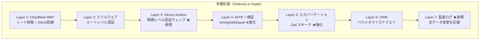

> **改善提案（優先度順）:**
> 1. 全 Server Actions に `const session = await auth(); if (!session) throw new Error("Unauthorized");` を追加
> 2. `isAdminUser()` のデフォルトを `return false` に修正
> 3. APIキー比較を `crypto.timingSafeEqual()` に変更
> 4. `audit_logs` テーブルを新設し、全データ変更を記録
> 5. Cloudflare WAF でレート制限を設定（Webhook: 60req/min 等）

> **もっと学ぶなら:**
> - 「OWASP Top 10 2025」— Webアプリの代表的な脆弱性
> - 「Defense in Depth（多層防御）」— セキュリティアーキテクチャの基本原則
> - 「Timing Attack」— なぜ文字列比較で `===` を使ってはいけないか

### 4.5. 監査/記録

#### 4.5.1. 現状

| 項目 | 状態 |
|:---|:---|
| アクセスログ | Cloudflare Workers のリクエストログ（自動） |
| アプリケーションログ | `console.error` のみ（クライアント + サーバー） |
| データ変更ログ | **なし** |
| GASログ | `Logger.log()` → 実行ログ（30日保持） |

#### 4.5.2. 改善後の姿

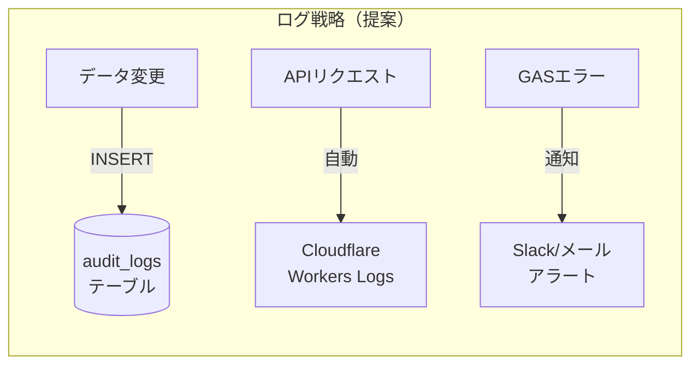

**提案する `audit_logs` テーブル:**

| カラム | 型 | 説明 |
|:---|:---|:---|
| id | TEXT (UUID) | 主キー |
| userId | TEXT | 操作者のユーザーID |
| action | TEXT | `create` / `update` / `delete` |
| targetTable | TEXT | 対象テーブル名 |
| targetId | TEXT | 対象レコードID |
| changes | TEXT (JSON) | 変更前後の値 |
| createdAt | INTEGER | タイムスタンプ |

> **設計判断メモ:**
> 個人情報を扱うシステムでは、「誰が・いつ・何を・どう変更したか」の追跡が不可欠です。
> 問題発生時の調査だけでなく、不正アクセスの検知にも活用できます。
> `changes` カラムを JSON で持つことで、スキーマ変更の影響を受けにくくしています。

### 4.6. ネットワーク構成

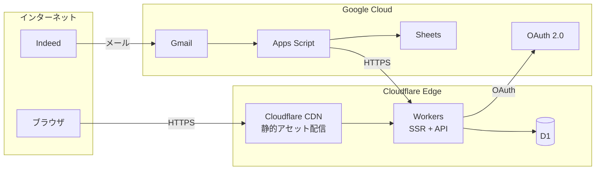

---

## 5. データ仕様

DB設計書 (`rpo_24cs_database_design_v1.md`) に詳細を記載。ここでは概要のみ。

| テーブル | 主な用途 | 件数想定 |
|:---|:---|:---|
| users | NextAuth ユーザー | 〜10件 |
| accounts | OAuth プロバイダリンク | 〜10件 |
| sessions | JWT セッション | NextAuth管理 |
| verificationTokens | メール検証トークン | NextAuth管理 |
| companies | クライアント企業 | 〜30件 |
| applicants | 応募者（コア） | 数千〜数万件/年 |
| callLogs | 架電記録 | applicants の数倍 |
| interviews | 面接記録 | applicants の一部 |
| audit_logs（提案） | 監査ログ | 全データ変更 |

---

## 6. 外部インターフェース

| ID | 連携先 | 方向 | プロトコル | 認証方式 | データ形式 |
|:---|:---|:---|:---|:---|:---|
| IF-01 | Google OAuth | 双方向 | OAuth 2.0 | Client ID/Secret | JWT |
| IF-02 | GAS → Indeed Webhook | 受信 | HTTPS POST | APIキー (Header) | JSON |
| IF-03 | GAS → Sync API | 送信 | HTTPS POST | APIキー (Header) | JSON（ページネーション） |
| IF-04 | GAS → Google Sheets | 送信 | Sheets API | Script Properties | 行データ |
| IF-05 | GAS → Gmail | 受信 | Gmail API (Advanced) | Script Properties | メールHTML |
| IF-06 | ブラウザ → CSV | 送信 | HTTPS GET | Session Cookie | text/csv |

**IF-02: Indeed Webhook ペイロード仕様:**

```json
{
  "name": "山田太郎",
  "company": "株式会社サンプル",
  "job": "営業職",
  "location": "東京都",
  "email": "yamada@example.com",
  "receivedAt": "2026-03-08T10:00:00Z",
  "gmailMessageId": "18e1234abcd5678",
  "gmailThreadId": "18e1234abcd0000"
}
```

**IF-03: Sync API リクエスト/レスポンス仕様:**

```json
// リクエスト
{
  "companyCode": "company_001",
  "companyName": "株式会社サンプル",
  "updatedAfter": "2026-03-01T00:00:00Z",
  "cursor": "{\"updatedAt\":1709312400,\"id\":\"abc-123\"}",
  "limit": 200
}

// レスポンス
{
  "success": true,
  "data": {
    "records": [
      {
        "applicantId": "uuid-...",
        "name": "山田太郎",
        "validApply": 1,
        "connected": 1,
        "updatedAt": "2026-03-08T10:00:00.000Z"
      }
    ],
    "nextCursor": "{\"updatedAt\":1709312000,\"id\":\"def-456\"}",
    "resolutionStrategy": "exact"
  }
}
```

---

## 7. テスト/受入基準

### 7.1. 現状

| 項目 | 状態 |
|:---|:---|
| ユニットテスト | **なし** |
| 統合テスト | **なし** |
| E2Eテスト | **なし** |
| 手動テスト | 開発者による目視確認 |

### 7.2. 改善後のテスト戦略

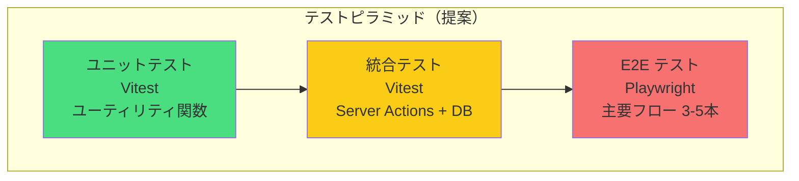

**Phase 1: ユニットテスト（最優先）**

| 対象 | テスト内容 | 想定テスト数 |
|:---|:---|:---|
| 日付パース (`parseBirthDateInput`) | 正常値、境界値、不正値 | 8-10件 |
| 年齢計算 (`calcAge`) | 通常、うるう年、誕生日当日 | 5-6件 |
| 電話番号バリデーション | 正常、ハイフン付き、桁数不足/超過 | 6-8件 |
| 企業名正規化 (`normalizeCompanyName`) | 正規化パターン全種 | 10-15件 |
| CSV エスケープ | ダブルクォート、改行、カンマ | 4-5件 |

**Phase 2: 統合テスト**

| 対象 | テスト内容 |
|:---|:---|
| `getApplicants` | フィルタ、ページネーション、ソート |
| `updateApplicant` | 各フィールド更新、バリデーション |
| `addCallLog` | 架電追加 + connectedAt 同期 |
| `getCompanyYields` | 歩留まり計算の正確性 |
| Indeed Webhook | 正常、重複、バリデーションエラー |

**Phase 3: E2Eテスト**

| シナリオ | ステップ |
|:---|:---|
| ログイン→一覧→詳細 | OAuth → 応募者一覧表示 → 詳細画面遷移 |
| 応募者編集 | 詳細画面 → チェックボックス変更 → 一覧に反映確認 |
| CSV出力 | 歩留まり画面 → CSVダウンロード → ファイル内容検証 |

### 7.3. 受入基準（UAT）

| # | テスト項目 | 合格基準 |
|:---|:---|:---|
| UAT-01 | ログイン | 許可リストのGoogleアカウントでログインでき、非許可アカウントは拒否される |
| UAT-02 | 応募者一覧 | 企業フィルタ・名前検索・ページネーションが正常動作する |
| UAT-03 | 応募者編集 | フィールド変更がDBに反映され、一覧・詳細画面に最新値が表示される |
| UAT-04 | インライン編集 | 一覧画面でのチェックボックス・ドロップダウン変更が即座に保存される |
| UAT-05 | Indeed自動取込 | GASからのWebhookで応募者が登録され、重複が排除される |
| UAT-06 | 架電登録 | 応募者を選択して架電を記録でき、通電時に connectedAt が更新される |
| UAT-07 | 歩留まり表示 | 企業別・月別の歩留まり率が手計算と一致する |
| UAT-08 | CSV出力 | ダウンロードしたCSVがExcelで文字化けなく開ける |
| UAT-09 | Sheets同期 | 26社のスプレッドシートにデータが正しく反映される |
| UAT-10 | アクセス制御 | 未認証ユーザーがダッシュボードにアクセスできない |

> **もっと学ぶなら:**
> - 「Testing Trophy (Kent C. Dodds)」— ユニットテスト偏重ではなく統合テスト重視のアプローチ
> - 「Vitest + Next.js セットアップ」で検索

---

## 8. 運用/保守

### 8.1. デプロイ手順

**現状:**

```bash
# ローカル開発
npm run dev:local  # D1ローカルマイグレーション + dev サーバー起動

# 本番デプロイ
npm run deploy     # OpenNext ビルド + Cloudflare Workers デプロイ

# DBマイグレーション（本番）
wrangler d1 migrations apply rpo-db --config wrangler.jsonc
```

**改善後（GitHub Actions 導入時）:**

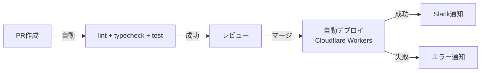

### 8.2. 定常運用

| タスク | 頻度 | 担当 | 現状 | 改善後 |
|:---|:---|:---|:---|:---|
| Indeed取込GAS監視 | 日次 | — | 実行ログ目視 | 失敗時自動通知 |
| Sheets同期GAS監視 | 日次 | — | 実行ログ目視 | 失敗時自動通知 |
| D1バックアップ確認 | 月次 | — | なし | Cloudflare ダッシュボードで確認 |
| 依存パッケージ更新 | 月次 | 開発者 | 手動 | Dependabot/Renovate 導入を検討 |

### 8.3. 障害対応

| 障害パターン | 検知方法 | 対応手順 |
|:---|:---|:---|
| Workers 障害 | Cloudflare Status / ユーザー報告 | Cloudflare ステータス確認 → 復旧待ち |
| D1 障害 | APIエラー増加 | Cloudflare 自動復旧に依存 |
| GAS 実行失敗 | 実行ログ（現状）→ 通知（改善後） | GASスクリプトのログ確認 → 手動再実行 |
| Indeed メール形式変更 | パースエラーラベル増加 | GASの正規表現パターン更新 |
| 認証障害（Google OAuth） | ログインできない報告 | JWT の有効期限内はセッション維持。Google側復旧待ち |

---

## 9. 潜在的なリスクと対策

| # | リスク | 影響度 | 発生可能性 | シナリオ | 対策 |
|:---|:---|:---|:---|:---|:---|
| R-01 | Server Actions 認証バイパス | 高 | 中 | 悪意あるリクエストで直接呼び出し | Server Actions 内に認証チェック追加 |
| R-02 | APIキー漏洩 | 高 | 低 | GAS Script Properties からの漏洩 | 定期的なキーローテーション、検知時即無効化 |
| R-03 | Indeed メール形式変更 | 中 | 中 | HTML構造変更でパース失敗 | `PARSE_ERROR` ラベルで即検知、パターン更新 |
| R-04 | D1 データ量上限到達 | 中 | 低 | 数年後に 10GB 超過 | アーカイブ戦略、または PostgreSQL 移行 |
| R-05 | GAS 実行時間超過 | 中 | 低 | 企業数増加で6分制限に到達 | 企業グループごとに分割実行 |
| R-06 | 誤削除（応募者/架電ログ） | 高 | 中 | オペレーターの操作ミス | 論理削除の導入、確認ダイアログの強化 |
| R-07 | NextAuth v5 破壊的変更 | 低 | 中 | beta → GA で API 変更 | GA リリースノート追跡、早期アップデート |
| R-08 | 同時編集の競合 | 低 | 中 | 2名が同じ応募者を同時編集 | 楽観的ロック（updatedAt 比較）の導入を検討 |

---

## 10. 命名規則

### 10.1. コード命名

| 対象 | 規則 | 例 |
|:---|:---|:---|
| コンポーネント | PascalCase | `ApplicantsTableClient`, `CompanyFilterSelect` |
| 関数 / 変数 | camelCase | `getApplicants`, `filterCompanyId` |
| Server Actions | camelCase（動詞始まり） | `updateApplicant`, `addCallLog` |
| 定数 | UPPER_SNAKE_CASE | `AUTO_SAVE_DELAY_MS`, `STATUS_OPTIONS` |
| ファイル（コンポーネント） | PascalCase.tsx | `ApplicantDetailClient.tsx` |
| ファイル（ユーティリティ） | kebab-case.ts | `company-name.ts`, `runtime-env.ts` |
| ファイル（Server Actions） | camelCase.ts | `actions.ts`, `applicant.ts` |

### 10.2. DB 命名

| 対象 | 規則 | 例 |
|:---|:---|:---|
| テーブル名 | camelCase（複数形） | `applicants`, `callLogs` |
| カラム名 | camelCase | `companyId`, `appliedAt`, `isValidApplicant` |
| ブールカラム | `is` / `has` プレフィックス | `isUniqueApplicant`, `isConnected` |
| 日付カラム | `〜At` / `〜Date` サフィックス | `createdAt`, `joinedDate` |
| 外部キー | `参照テーブル名(単数)Id` | `companyId`, `applicantId` |
| インデックス | `idx_テーブル名_カラム名` | `idx_applicant_company_applied` |

### 10.3. ブランチ戦略（提案）

| ブランチ | 用途 |
|:---|:---|
| `main` | 本番デプロイ対象 |
| `feature/<概要>` | 新機能開発 |
| `fix/<概要>` | バグ修正 |
| `chore/<概要>` | 設定変更、依存更新等 |

> **設計判断メモ:**
> 現状は main ブランチへの直接コミットで運用されています。
> 10名規模のチームでは、feature ブランチ + PR レビューの導入を推奨します。
> ただし、過度に複雑なブランチ戦略（Git Flow 等）は不要です。GitHub Flow で十分です。

---

## 11. 障害検知とエラーハンドリング

### 11.1. エラーシナリオ一覧

| # | エラー | 発生箇所 | 現状の処理 | 改善案 |
|:---|:---|:---|:---|:---|
| E-01 | 未認証アクセス | ミドルウェア | `/login` リダイレクト | 現状維持（適切） |
| E-02 | Server Action 失敗 | Client Components | `alert("更新に失敗しました")` | Toast通知 + エラー種別の区別 |
| E-03 | APIキー不正 | Webhook / Sync | 401 JSON レスポンス | レート制限追加 |
| E-04 | バリデーションエラー | Webhook | 400 JSON レスポンス | 現状維持（適切） |
| E-05 | DB接続エラー | Server Actions / API | 未キャッチ → 500 | try-catch + 構造化ログ |
| E-06 | 応募者未存在 | 詳細ページ | `notFound()` | 現状維持（適切） |
| E-07 | 重複応募 | Webhook | 200 + `already_imported` | 現状維持（適切） |
| E-08 | GASパースエラー | applier_trans.gs | `PARSE_ERROR` ラベル + ログ | Slack通知追加 |
| E-09 | GAS API呼び出し失敗 | applier_trans.gs | `API_ERROR` ラベル + ログ | リトライ + Slack通知 |
| E-10 | Sheets書き込み失敗 | db_to_spreadsheet_sync.gs | ログ出力（サイレント） | エラーカウント + 通知 |

### 11.2. エラー処理フロー

**現状:**

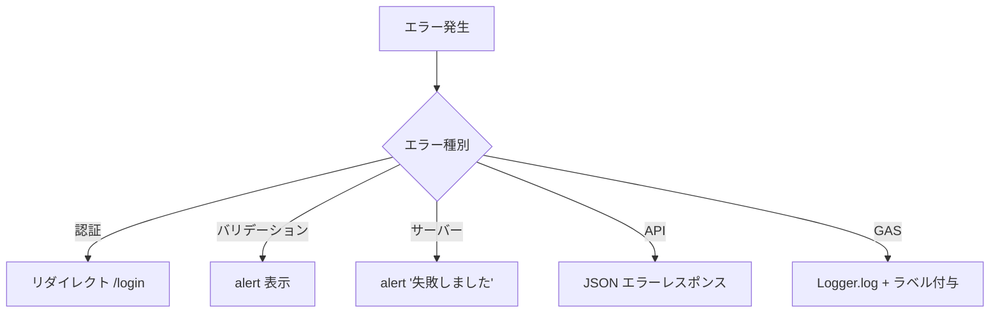

**改善後:**

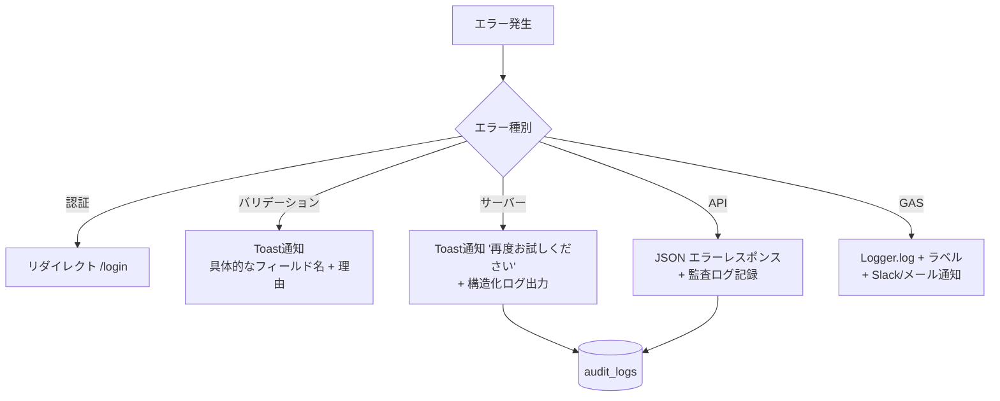

### 11.3. ロギング方針（提案）

| レベル | 用途 | 出力先 |
|:---|:---|:---|
| ERROR | 障害・データ不整合 | Cloudflare Workers Logs + 通知 |
| WARN | 潜在的な問題（パースエラー等） | Cloudflare Workers Logs |
| INFO | 通常操作（CRUD実行） | audit_logs テーブル |
| DEBUG | 開発時のみ | console.log（本番では無効化） |

> **改善提案:**
> 現状は `console.error` のみですが、構造化ログ（JSON形式）の導入を推奨します。
> Cloudflare Workers のログは Logpush で外部サービス（Datadog等）に転送可能です。
> 10名規模では過剰ですが、将来的な拡張の選択肢として認識しておくと良いでしょう。

> **もっと学ぶなら:**
> - 「Structured Logging」— JSON形式ログの利点
> - 「Observability の3本柱（Logs, Metrics, Traces）」
