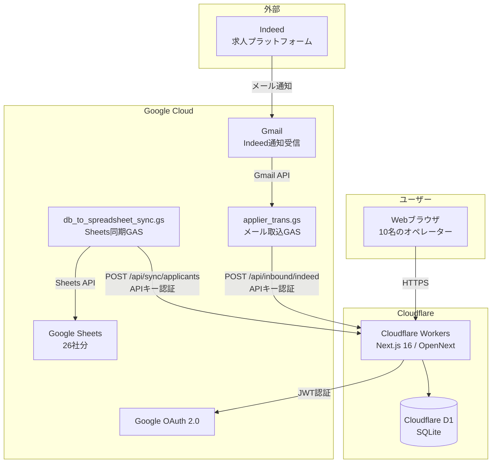
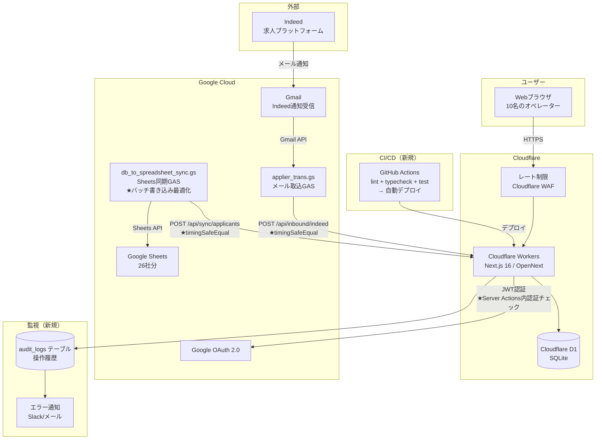

# RPO_24CS 技術選定評価書 v1

> **ドキュメント情報**
> - プロジェクト名: RPO_24CS（採用プロセス最適化システム）
> - 作成日: 2026-03-08
> - モード: 分析モード（既存技術スタックの評価＋改善提案）

---

## 1. 技術スタック一覧と評価

### 1.1. フロントエンド

| 技術 | バージョン | 評価 | 改善案 | 理由 |
|:---|:---|:---|:---|:---|
| Next.js | 16.1.5 | **現状維持** | — | App Router + Server Components で最新アーキテクチャ。Cloudflareとの相性も良好 |
| React | 19.1.5 | **現状維持** | — | Server Components、useTransition 等の最新機能を活用済み |
| TypeScript | 5.7.4 | **現状維持** | — | strict モード有効。型安全性が確保されている |
| Tailwind CSS | 4.0 | **現状維持** | — | ユーティリティファーストで保守性が高い |
| Shadcn/ui + Radix UI | 最新 | **現状維持** | — | アクセシブルなヘッドレスUIコンポーネント。業務アプリに適切 |
| React Hook Form + Zod | 7.71 / 4.3 | **現状維持** | — | バリデーション付きフォーム管理の標準的な組み合わせ |

> **なぜこの評価か？**
> フロントエンド技術は全体的にモダンで適切な選定です。
> Next.js 16 + React 19 は2026年時点で最新のメジャーバージョンであり、
> Server Components によるパフォーマンス最適化、Tailwind + Shadcn/ui による
> 一貫したUI構築が実現されています。変更の必要はありません。

> **もっと学ぶなら:**
> - 「React Server Components」の公式ドキュメント
> - 「Shadcn/ui」— コンポーネントをコピーして所有するアプローチの利点

---

### 1.2. バックエンド

| 技術 | バージョン | 評価 | 改善案 | 理由 |
|:---|:---|:---|:---|:---|
| Next.js Server Actions | 16.x | **現状維持** | 認証チェック追加 | フォーム操作とDB更新に適切。ただしセキュリティ強化が必要 |
| Next.js API Routes | 16.x | **現状維持** | レート制限追加 | Webhook受信・CSV出力に適切 |
| NextAuth.js | 5.0-beta.30 | **要注視** | GA版リリース時にアップデート | beta版のため、破壊的変更のリスクあり |

> **なぜこの評価か？**
> Server Actions は Next.js の推奨パターンであり、10名規模の業務アプリには最適です。
> 別途バックエンドサーバーを立てる必要がなく、フルスタックを1プロジェクトで管理できます。
>
> NextAuth.js 5 は beta 版ですが、Next.js 16 との統合に必要なバージョンです。
> GA版がリリースされ次第アップデートすることを推奨しますが、
> 現時点で致命的な問題はありません。

> **もっと学ぶなら:**
> - 「Next.js Server Actions vs API Routes」— 使い分けの判断基準
> - 「NextAuth.js v5 Migration Guide」— v4 → v5 の変更点

---

### 1.3. データベース

| 技術 | バージョン | 評価 | 改善案 | 理由 |
|:---|:---|:---|:---|:---|
| Cloudflare D1 (SQLite) | — | **現状維持** | インデックス追加 | エッジDBで低レイテンシ。10名規模に十分 |
| Drizzle ORM | 0.45.1 | **現状維持** | 最新版追従 | 型安全なSQL構築。SQLiteとの相性良好 |
| Drizzle Kit | 0.31.9 | **現状維持** | — | マイグレーション管理に必要十分 |
| better-sqlite3 | 12.6.2 | **現状維持** | — | ローカル開発用。本番には影響なし |

> **なぜこの評価か？**
> 「なぜ PostgreSQL や MySQL ではなく SQLite (D1) なのか？」はよくある疑問です。
>
> **D1を選んだ理由:**
> 1. Cloudflare Workers から直接アクセスでき、ネットワークレイテンシがゼロ
> 2. 接続プール管理が不要（コネクションレスアーキテクチャ）
> 3. 10名・数万レコード規模ならSQLiteの性能で十分
> 4. 運用コストが極めて低い（Cloudflareの無料枠で収まる可能性あり）
>
> **PostgreSQLが有利になるケース（将来の検討ポイント）:**
> - 複雑なJOIN、サブクエリが頻発する場合
> - 同時書き込みが多い場合（SQLiteはWriter Lock）
> - 100名超のユーザーや100万レコード超の場合
>
> 現時点では D1 が最適です。

> **もっと学ぶなら:**
> - 「SQLite is not a toy database」で検索
> - 「Cloudflare D1 vs Neon vs PlanetScale」— エッジDB比較
> - Drizzle ORM 公式ドキュメントの「SQLite」セクション

---

### 1.4. デプロイ・インフラ

| 技術 | バージョン | 評価 | 改善案 | 理由 |
|:---|:---|:---|:---|:---|
| Cloudflare Workers | — | **現状維持** | — | エッジコンピューティングで高速。D1との親和性 |
| OpenNext.js | 1.15.1 | **現状維持** | — | Next.js → Cloudflare 変換アダプタ。必須 |
| Wrangler | 4.67.0 | **現状維持** | — | Cloudflare CLIツール |
| Vercel | — | **現状維持** | — | プレビューデプロイに有用 |

> **なぜこの評価か？**
> Cloudflare Workers + D1 の組み合わせは、このプロジェクトの規模に最適です。
>
> **Vercel ではなく Cloudflare を本番に選んだ理由（推測）:**
> 1. D1（SQLite）との一体運用 — Vercel は外部DB接続が必要
> 2. コスト — Workers の無料枠は10万リクエスト/日、小規模なら無料
> 3. エッジ実行 — グローバルに低レイテンシ（日本リージョンあり）
>
> OpenNext.js はNext.jsをCloudflare上で動かすためのアダプタで、
> Vercel以外のプラットフォームでNext.jsを運用する際の標準的な選択です。

> **もっと学ぶなら:**
> - 「OpenNext.js」公式ドキュメント — Next.js のプラットフォーム非依存化
> - 「Cloudflare Workers vs AWS Lambda@Edge vs Vercel Edge Functions」

---

### 1.5. 外部連携・自動化

| 技術 | バージョン | 評価 | 改善案 | 理由 |
|:---|:---|:---|:---|:---|
| Google Apps Script (GAS) | V8 | **現状維持** | バッチ書き込み最適化 | Gmail/Sheets連携の唯一の手段。妥当な選択 |
| Gmail API (Advanced) | — | **現状維持** | — | GAS内でのメール取得に必要 |
| Google Sheets API | — | **現状維持** | — | 既存のSheets運用を維持するために必要 |

> **なぜこの評価か？**
> GAS は Google Workspace との連携において、実質的に唯一の選択肢です。
>
> **「なぜGASなのか？Node.jsスクリプトではダメなのか？」:**
> 1. Gmail API / Sheets API へのアクセスが簡単（OAuth設定不要で組織内利用可能）
> 2. Google 側でホスティングされるため、自前サーバー不要
> 3. 時間ベースのトリガー（cron相当）が無料で使える
> 4. Script Properties でAPIキーを管理できる
>
> **GASの制約:**
> - 実行時間制限（6分/実行）
> - デバッグ環境が貧弱
> - バージョン管理がしにくい（clasp で改善可能）
>
> 現在のスクリプトは制約内で適切に動作しており、変更の必要はありません。
> ただし、Sheets書き込みのバッチ化による効率改善は推奨します。

> **もっと学ぶなら:**
> - 「clasp」— GAS をローカル開発・Git管理するツール
> - 「Google Apps Script Best Practices」公式ガイド

---

### 1.6. 未導入だが導入を推奨する技術

| 技術 | 目的 | 推奨理由 | 優先度 |
|:---|:---|:---|:---|
| **Jest / Vitest** | ユニットテスト | 日付パース・バリデーション等のロジックテストに必須 | 高 |
| **GitHub Actions** | CI/CD | lint + typecheck の自動実行、mainマージ時の自動デプロイ | 高 |
| **Vitest + Testing Library** | コンポーネントテスト | UI の振る舞いテスト（将来的に） | 中 |
| **Playwright** | E2Eテスト | 主要フロー（ログイン→一覧→詳細→編集）の自動テスト | 低 |

> **なぜ Jest ではなく Vitest を推奨するか？**
> Vitest は Vite ベースで、ESModules ネイティブ対応・高速実行が特徴です。
> Next.js 16 との相性も良く、設定が最小限で済みます。
> ただし、Jest も十分に成熟しており、チームの慣れに合わせて選択してください。

> **もっと学ぶなら:**
> - 「Vitest vs Jest 2025」で検索 — 比較記事が多数
> - 「GitHub Actions for Next.js」— CI/CD 設定例

---

## 2. システム構成図

### 2.1. 現状のシステム構成図

### 2.2. 改善後のシステム構成図（提案）

**改善後の主な変更点:**
- レート制限の追加（Cloudflare WAF）
- Server Actions内の認証チェック追加
- APIキー検証の強化（timingSafeEqual）
- 監査ログテーブルの導入
- CI/CDパイプラインの構築
- GAS Sheets書き込みのバッチ最適化

---

## 3. 技術選定サマリー

| カテゴリ | 現状の評価 | アクション |
|:---|:---|:---|
| フロントエンド (Next.js/React/TS/Tailwind) | **優良** | 変更不要 |
| バックエンド (Server Actions/API Routes) | **良好** | セキュリティ強化のみ |
| DB (D1/Drizzle) | **良好** | インデックス追加 |
| 認証 (NextAuth v5 beta) | **許容** | GA版リリース時にアップデート |
| デプロイ (Cloudflare/OpenNext) | **優良** | 変更不要 |
| GAS連携 | **良好** | Sheets書き込みバッチ化 |
| テスト | **未導入** | Vitest導入を強く推奨 |
| CI/CD | **未導入** | GitHub Actions導入を推奨 |
| 監視・監査 | **未導入** | 監査ログ + エラー通知を推奨 |

> **総評:**
> 技術選定は全体的に適切で、2026年時点でモダンなスタックです。
> 個々の技術を変更する必要はなく、**運用面の強化**（テスト・CI/CD・監査）が最優先です。
> これは技術選定の問題ではなく、プロジェクトの成熟度の問題であり、
> 段階的に整備していくのが現実的です。
