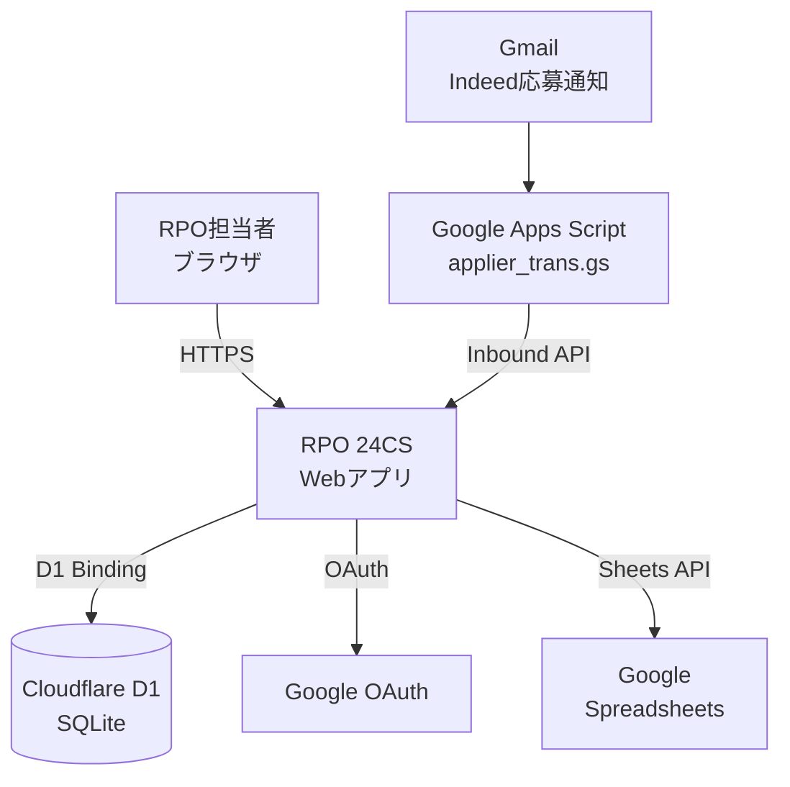
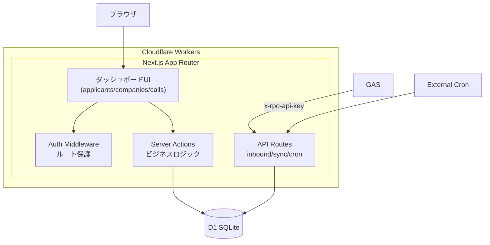
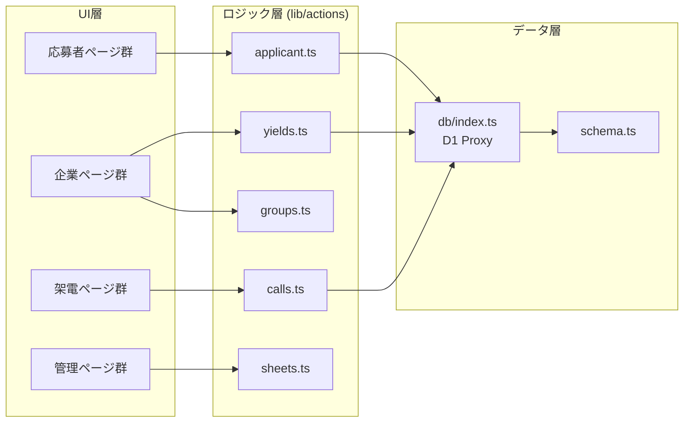
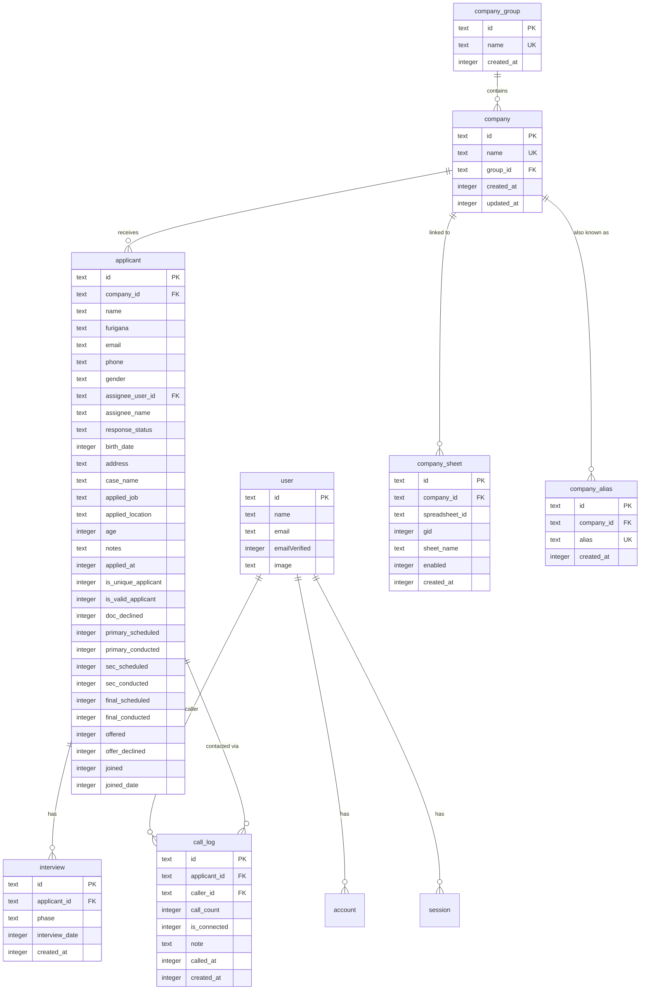
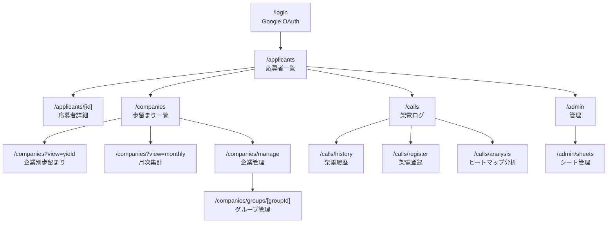

# RPO 24CS システム仕様書

## 1. 概要（Context）

- **WHO**: 開発者、RPO事業担当者、外部パートナー
- **WHAT**: 採用プロセスアウトソーシング（RPO）の応募者管理・歩留まり分析・架電管理を一元化するWebアプリケーション
- **WHY**: 紹介先企業ごとの採用パイプラインを可視化し、歩留まり改善・架電効率の最適化を支援する。従来のスプレッドシート運用からの脱却と、データドリブンな採用業務の実現が目的

## 2. 用語集（Glossary）

| 用語 | 定義 |
|------|------|
| RPO | Recruitment Process Outsourcing（採用プロセスアウトソーシング） |
| 歩留まり | 採用パイプラインの各段階における通過率・離脱率 |
| 有効応募 | 重複・無効を除いた実質的な応募（`isValidApplicant = true`） |
| ユニーク応募 | 同一人物の重複を排除した応募（`isUniqueApplicant = true`） |
| 通電 | 応募者との電話接続に成功した状態（`isConnected = true`） |
| 企業グループ | 複数の紹介先企業を1つのグループとして集約管理する単位 |
| 企業エイリアス | 同一企業の別名表記（名寄せ用） |
| GAS | Google Apps Script。スプレッドシート連携やデータ取込に使用 |
| Inbound API | 外部ソース（Indeed等）からの応募者データ受信エンドポイント |

## 3. 技術スタック

| カテゴリ | 技術 | バージョン |
|----------|------|-----------|
| 言語 | TypeScript | 5.7.4 |
| フレームワーク | Next.js (App Router) | 16.1.5 |
| UI ライブラリ | React | 19.1.5 |
| CSS | Tailwind CSS | 4.x |
| UI コンポーネント | shadcn/ui (Radix UI) | 3.8.5 |
| アイコン | Lucide React | 0.575.0 |
| フォーム | React Hook Form + Zod | 7.71.1 / 4.3.6 |
| ORM | Drizzle ORM | 0.45.1 |
| データベース | Cloudflare D1 (SQLite) | - |
| 認証 | NextAuth.js (Google OAuth / JWT) | 5.0.0-beta.30 |
| デプロイ | Cloudflare Workers (OpenNextJS) | 1.15.1 |
| CLI | Wrangler | 4.67.0 |
| テスト | Vitest | 3.2.4 |
| データ連携 | Google Apps Script | - |

## 4. アーキテクチャ（C4モデル）

### 4.1 システムコンテキスト図（L1）



### 4.2 コンテナ図（L2）



### 4.3 コンポーネント図（L3）



## 5. ディレクトリ構成

```
RPO_24CS/
├── rpo-app/                      # メインWebアプリケーション
│   ├── src/
│   │   ├── app/
│   │   │   ├── (dashboard)/      # 認証保護ページ
│   │   │   │   ├── applicants/   # 応募者管理（一覧・詳細）
│   │   │   │   ├── calls/        # 架電ログ（履歴・登録・分析）
│   │   │   │   ├── companies/    # 企業管理（歩留まり・月次・管理）
│   │   │   │   └── admin/        # 管理（シート設定）
│   │   │   ├── api/
│   │   │   │   ├── inbound/      # 外部データ取込
│   │   │   │   ├── sync/         # データ同期
│   │   │   │   ├── companies/    # CSVエクスポート
│   │   │   │   ├── admin/        # 管理API
│   │   │   │   └── cron/         # 定期実行
│   │   │   └── login/            # ログインページ
│   │   ├── components/           # 共通UIコンポーネント
│   │   ├── db/                   # DBスキーマ・クライアント
│   │   ├── lib/                  # ビジネスロジック
│   │   │   ├── actions/          # Server Actions
│   │   │   ├── company-name.ts   # 企業名正規化
│   │   │   ├── google-auth.ts    # Google認証ヘルパー
│   │   │   ├── google-sheets.ts  # Sheets API連携
│   │   │   ├── runtime-env.ts    # 環境変数解決
│   │   │   └── userAccess.ts     # ログイン許可リスト
│   │   ├── types/                # 型定義
│   │   ├── auth.ts               # NextAuth設定
│   │   └── middleware.ts         # ルート保護
│   ├── drizzle/                  # DBマイグレーション（0000〜0018）
│   ├── scripts/                  # データインポートスクリプト
│   └── public/                   # 静的ファイル
│
├── gas/                          # Google Apps Script
│   ├── applier_trans.gs          # Indeed応募メール→API変換
│   ├── db_to_spreadsheet_sync.gs # DB→スプレッドシート同期 v1
│   ├── db_to_spreadsheet_sync_v2.gs # DB→スプレッドシート同期 v2
│   ├── duplicate_sheets.gs       # シート複製ユーティリティ
│   ├── migrate_sheet_structure.gs # シート構造マイグレーション
│   └── migrate_tabs.gs           # タブ移行
│
├── data/                         # データファイル（CSV）
├── docs/                         # ドキュメント
└── logs/                         # ログ（gitignored）
```

## 6. データベース設計

### ER図



### テーブル一覧

| テーブル | 用途 | レコード規模（想定） |
|----------|------|---------------------|
| `user` | ユーザーアカウント（NextAuth） | 〜10 |
| `account` | OAuthプロバイダー連携 | 〜10 |
| `session` | セッション管理 | 〜10 |
| `verificationToken` | メール認証トークン | 一時的 |
| `company_group` | 企業グループ | 〜20 |
| `company` | 紹介先企業 | 〜100 |
| `company_alias` | 企業別名 | 〜200 |
| `company_sheet` | Google Sheets マッピング | 〜100 |
| `applicant` | 応募者 | 〜10,000/年 |
| `interview` | 面接スケジュール | 〜5,000/年 |
| `call_log` | 架電ログ | 〜50,000/年 |

### マイグレーション方針

- Drizzle Kit によるマイグレーションファイル管理（`drizzle/` ディレクトリ）
- 番号付き連番ファイル（`0000_*.sql` 〜 `0018_*.sql`）
- `wrangler d1 migrations apply` でCloudflare D1に適用

## 7. API 仕様

### エンドポイント一覧

| メソッド | パス | 概要 | 認証 |
|----------|------|------|------|
| `POST` | `/api/inbound/indeed` | Indeed/GAS経由の応募者データ取込 | APIキー |
| `GET` | `/api/sync/companies` | 企業一覧 | APIキー |
| `GET` | `/api/sync/applicants` | 応募者一覧（フィルタ・ページング） | APIキー |
| `GET` | `/api/sync/company-sheets` | 有効なSheets設定一覧 | APIキー |
| `GET` | `/api/companies/yields/csv` | 歩留まりCSVエクスポート | セッション |
| `GET` | `/api/companies/monthly-yields/csv` | 月次歩留まりCSVエクスポート | セッション |
| `POST` | `/api/admin/migrate-sheets` | シートデータ移行 | セッション |
| `POST` | `/api/admin/update-sheet-gids` | シートGID更新 | セッション |
| `GET` | `/api/cron/update-ages` | 年齢自動更新 | APIキー |

### 認証・認可方式

- **UI**: NextAuth.js (Google OAuth + JWT) → Middleware でルート保護
- **API**: `x-rpo-api-key` ヘッダーによるAPIキー認証
- **保護対象ルート**: `/applicants/*`, `/companies/*`, `/calls/*`
- **ログイン許可**: `ALLOWED_LOGIN_LIST` 環境変数でメール/ドメイン単位で制御

### Inbound API リクエストスキーマ

```typescript
// POST /api/inbound/indeed
{
  name: string;         // 応募者名
  company: string;      // 企業名（名寄せあり）
  caseName?: string;    // 案件名
  appliedJob?: string;  // 応募職種
  appliedLocation?: string; // 応募勤務地
  email?: string;       // メールアドレス
  gmailMessageId?: string; // Gmail メッセージID（重複チェック用）
  threadId?: string;    // Gmail スレッドID
  appliedAt?: string;   // 応募日時
  receivedAt?: string;  // 受信日時
}
```

## 8. 機能要件（Functional Requirements）

| ID | 概要 | 優先度 | ステータス | 根拠 |
|----|------|--------|-----------|------|
| FR-01 | 応募者の一覧表示（検索・フィルタ・ページング） | 高 | 実装済 | 大量応募者から効率的に対象を絞り込む必要がある |
| FR-02 | 応募者詳細の閲覧・編集 | 高 | 実装済 | 40+のステータスフラグを個別に管理する必要がある |
| FR-03 | 企業別歩留まり分析 | 高 | 実装済 | 紹介先企業ごとの採用効率を可視化し改善につなげる |
| FR-04 | 月次集計レポート | 中 | 実装済 | 経営層への定期報告に必要 |
| FR-05 | 架電ログの記録 | 高 | 実装済 | 架電業務の記録と分析が日常業務の中心 |
| FR-06 | 架電ヒートマップ分析 | 中 | 実装済 | 曜日×時間帯の接続率を分析し架電効率を最適化 |
| FR-07 | Indeed応募の自動取込（GAS→API） | 高 | 実装済 | 手入力の工数削減、リアルタイム反映 |
| FR-08 | Google Sheets 双方向同期 | 中 | 実装済 | クライアントへの情報共有がスプレッドシート前提 |
| FR-09 | CSVエクスポート（歩留まり・月次） | 中 | 実装済 | 外部ツールでの分析・報告書作成に必要 |
| FR-10 | Google OAuth によるログイン | 高 | 実装済 | 社内Google Workspaceとの統合 |
| FR-11 | 企業グループ管理 | 低 | 実装済 | 同一クライアントの複数法人を集約管理 |
| FR-12 | 企業名エイリアス（名寄せ） | 中 | 実装済 | Indeed等で表記揺れが発生するため自動マッチングが必要 |
| FR-13 | 年齢自動更新（Cron） | 低 | 実装済 | 生年月日から現在年齢を定期計算 |

## 9. 非機能要件（ISO/IEC 25010 準拠）

### 性能効率性

| 指標 | 目標値 | 根拠 |
|------|--------|------|
| ページ初期表示 | 95パーセンタイル 2秒以内 | RPO担当者が頻繁に画面遷移するため体感速度が重要 |
| API応答時間 | 95パーセンタイル 500ms以内 | GASからの同期呼び出しがタイムアウトしないよう |
| 同時接続ユーザー | 10名程度 | 現在の利用想定規模 |

### 信頼性

| 指標 | 目標値 |
|------|--------|
| 可用性 | Cloudflare Workers SLA に準拠（99.9%） |
| データ耐久性 | Cloudflare D1 の自動バックアップに依存 |

### セキュリティ

| 項目 | 対策 |
|------|------|
| 認証 | Google OAuth + JWT（NextAuth.js） |
| 認可 | メールアドレス/ドメイン単位の許可リスト |
| API保護 | `x-rpo-api-key` ヘッダー認証 |
| セッション管理 | JWT（サーバーサイドセッションなし） |
| オープンリダイレクト防止 | `sanitizeRedirect` によるURL検証 |
| 機密情報管理 | 環境変数 / Cloudflare Secrets（リポジトリに含めない） |

### 保守性

| 項目 | 方針 |
|------|------|
| テスト | Vitest によるユニットテスト |
| 型安全性 | TypeScript strict mode |
| スキーマ管理 | Drizzle ORM による型安全なDB操作 |
| マイグレーション | Drizzle Kit による連番管理 |

### 移植性

| 項目 | 対応状況 |
|------|---------|
| ランタイム | Cloudflare Workers（Edge Runtime） |
| ローカル開発 | better-sqlite3 による Node.js ローカル実行対応 |
| ステージング | `wrangler.jsonc` の `env.staging` で分離 |

## 10. 外部インターフェース

### Google Apps Script → Inbound API

- **フロー**: Gmail（Indeed応募通知）→ GAS（`applier_trans.gs`）→ `POST /api/inbound/indeed`
- **認証**: `x-rpo-api-key` ヘッダー
- **冪等性**: `sourceGmailMessageId` で重複チェック（UNIQUE制約）
- **エラーハンドリング**: 企業名が未登録の場合、GAS側でリトライまたはスキップ

### DB → Google Sheets 同期

- **フロー**: `db_to_spreadsheet_sync_v2.gs` がSync APIを呼び出し → スプレッドシートに書き出し
- **方向**: DB → Sheets（読み取り専用同期）
- **トリガー**: GAS のトリガー機能による定期実行

## 11. UI/画面設計

### 画面遷移図



### 主要画面

| 画面 | 主な機能 |
|------|---------|
| 応募者一覧 | 検索（名前・ふりがな）、企業・担当者・ステータスフィルタ、50件/ページ |
| 応募者詳細 | 個人情報編集、ステータスフラグ管理、面接追加、架電ログ表示 |
| 企業別歩留まり | 連絡率・面接率・内定率・入社率の一覧表示 |
| 月次集計 | 企業横断の月別採用実績 |
| 架電履歴 | 応募者別の架電ログ一覧 |
| 架電登録 | 架電結果の記録（接続/不接続、メモ） |
| ヒートマップ分析 | 曜日×2時間スロット（8-20時）の接続率マトリクス |
| シート管理 | 企業×Google Sheets マッピングの設定 |

## 12. 環境変数・設定

| 変数名 | 用途 | 設定場所 |
|--------|------|---------|
| `AUTH_SECRET` | NextAuth セッション暗号化キー | `.env.local` / Cloudflare Secrets |
| `AUTH_GOOGLE_ID` | Google OAuth クライアントID | `.env.local` / Cloudflare Secrets |
| `AUTH_GOOGLE_SECRET` | Google OAuth クライアントシークレット | `.env.local` / Cloudflare Secrets |
| `AUTH_TRUST_HOST` | NextAuth ホスト信頼設定 | `wrangler.jsonc` vars |
| `AUTH_URL` | NextAuth コールバックURL | `wrangler.jsonc` vars |
| `RPO_API_KEY` | 外部API認証キー | Cloudflare Secrets |
| `INBOUND_API_KEY` | Inbound API認証キー（レガシー） | Cloudflare Secrets |
| `ALLOWED_LOGIN_LIST` | ログイン許可メール/ドメインリスト | Cloudflare Secrets |
| `DEV_ACTOR_ID` | 開発用ユーザーID | `.env.local` |
| `DEV_ACTOR_NAME` | 開発用ユーザー名 | `.env.local` |
| `DEV_ACTOR_EMAIL` | 開発用ユーザーメール | `.env.local` |
| `GOOGLE_SERVICE_ACCOUNT_JSON` | Sheets API用サービスアカウント | Cloudflare Secrets |

## 13. ADR（Architecture Decision Records）

### ADR-001: Cloudflare D1 (SQLite) の採用

- **背景**: RPO業務のデータ規模は中小（年間1万件程度）。コスト効率とデプロイの簡素化が重要
- **検討した選択肢**: PostgreSQL (Supabase/Neon)、PlanetScale、Cloudflare D1
- **採用理由**: Cloudflare Workers との統合がネイティブで、Cold Start が最小。SQLiteベースのため運用コストが極めて低い
- **トレードオフ**: SQLite の制約（並列書き込み制限）を受容。現在の利用規模では問題にならない

### ADR-002: NextAuth.js + Google OAuth

- **背景**: 利用者は全員Google Workspace利用者
- **採用理由**: 既存のGoogle アカウントで即座にログイン可能。JWT戦略によりサーバーサイドセッション不要
- **トレードオフ**: NextAuth v5 beta のため、API変更リスクあり

### ADR-003: Google Apps Script による外部データ連携

- **背景**: Indeed からの応募通知はGmail に届く
- **採用理由**: GAS はGmail トリガーをネイティブにサポートし、追加インフラ不要でリアルタイム連携が可能
- **トレードオフ**: GAS のランタイム制約（6分タイムアウト）、デバッグの難しさ

### ADR-004: 応募者ステータスのフラグ管理

- **背景**: 採用パイプラインには40+の状態遷移がある
- **採用理由**: 各段階を独立したbooleanフラグで管理することで、歩留まり計算が単純なCOUNTクエリで実現可能
- **トレードオフ**: カラム数が多い。状態遷移の整合性チェックはアプリ層に依存

### ADR-005: OpenNextJS によるCloudflare Workers デプロイ

- **背景**: Next.js App Router のフル機能をEdge環境で動作させたい
- **採用理由**: Vercel以外の環境でNext.jsを動かすための唯一の成熟したアダプター
- **トレードオフ**: OpenNextJSの更新に依存。Next.js の一部機能に制約あり

## 14. 変更履歴

| 日付 | 変更者 | 変更内容 |
|------|--------|---------|
| 2026-03-23 | Claude Code | 初版作成。リポジトリ構造整理に伴い、全セクションを新規記述 |
