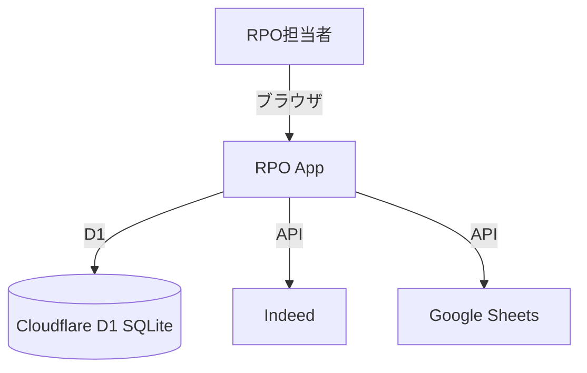
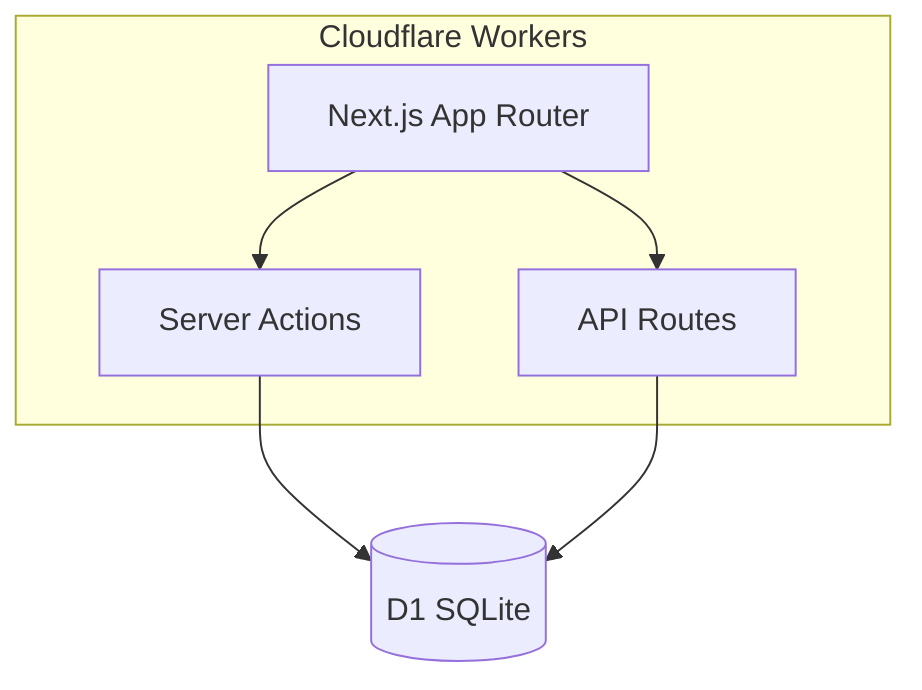
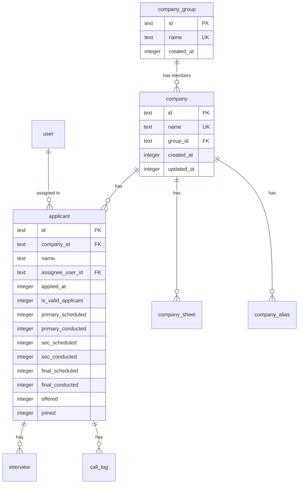

# RPO App システム仕様書

## 1. 概要（Context）
- **WHO**: 開発者、RPO事業担当者
- **WHAT**: 採用プロセスアウトソーシング（RPO）の応募者管理・歩留まり分析システム
- **WHY**: 紹介先企業ごとの採用パイプラインを可視化し、歩留まり改善を支援する

## 2. 用語集（Glossary）
| 用語 | 定義 |
|------|------|
| 歩留まり | 採用パイプラインの各段階における通過率・離脱率 |
| 有効応募 | 重複・無効を除いた実質的な応募 |
| 通電 | 応募者との電話接続に成功した状態 |
| 企業グループ | 複数の紹介先企業を1つのグループとして集約管理する単位 |

## 3. 技術スタック
- **言語**: TypeScript
- **フレームワーク**: Next.js 16.1.5 (App Router)
- **UI**: React 19.1.5, Tailwind CSS 4, shadcn/ui, Lucide Icons
- **ORM**: Drizzle ORM 0.45.1 (SQLite / D1)
- **認証**: NextAuth 5.0.0-beta.30
- **デプロイ**: Cloudflare Workers (opennextjs-cloudflare)
- **フォーム**: React Hook Form + Zod

## 4. アーキテクチャ（C4モデル）

### 4.1 システムコンテキスト図（L1）


### 4.2 コンテナ図（L2）


## 5. ディレクトリ構成
```
src/
├── app/
│   ├── (dashboard)/
│   │   ├── companies/           # 歩留まり管理・企業管理
│   │   │   ├── page.tsx         # メイン（企業別/月別ビュー）
│   │   │   ├── actions.ts       # Server Actions（削除、グループCRUD）
│   │   │   ├── CompaniesYieldTableClient.tsx    # 歩留まりテーブル
│   │   │   ├── CompaniesMonthlyTotalsClient.tsx # 月別累計テーブル
│   │   │   ├── CompanyManagementClient.tsx      # 企業・グループ管理UI
│   │   │   ├── anytime/page.tsx # → /companies/groups/[id] リダイレクト
│   │   │   └── groups/[groupId]/page.tsx # グループドリルダウン
│   │   ├── applicants/          # 応募者管理
│   │   └── calls/               # 架電管理
│   └── api/
│       ├── sync/                # 外部連携同期
│       ├── inbound/             # Indeed連携
│       └── companies/           # CSVエクスポート
├── db/
│   ├── schema.ts                # Drizzleスキーマ定義
│   └── index.ts                 # DB接続（D1 Proxy）
└── lib/
    ├── actions.ts               # 共通Server Actions
    └── actions/
        ├── yields.ts            # 歩留まり集計
        ├── groups.ts            # 企業グループCRUD
        ├── applicant.ts         # 応募者操作
        ├── calls.ts             # 架電操作
        └── sheets.ts            # シート連携
```

## 6. データベース設計

### ER図


### 主要テーブル

| テーブル | 説明 |
|---------|------|
| `company_group` | 企業グループ（集約表示の単位） |
| `company` | 紹介先企業。`group_id` で企業グループに所属 |
| `applicant` | 応募者。採用パイプラインの各フラグを保持 |
| `call_log` | 架電記録 |
| `interview` | 面接記録 |
| `company_sheet` | Google Sheets連携設定 |
| `company_alias` | 企業名のエイリアス |

## 7. API 仕様
- **認証**: NextAuth (Google OAuth)
- `GET /api/sync/companies` - 企業一覧取得（API Key認証）
- `POST /api/sync/applicants` - 応募者データ同期
- `GET /api/companies/yields/csv` - 歩留まりCSVエクスポート
- `GET /api/companies/monthly-yields/csv` - 月別累計CSVエクスポート

## 8. 機能要件（Functional Requirements）

| ID | 概要 | 優先度 | ステータス |
|----|------|--------|-----------|
| FR-001 | 企業別歩留まり表示 | 高 | 実装済み |
| FR-002 | 月別歩留まり累計表示 | 高 | 実装済み |
| FR-003 | 企業グルーピング（集約表示） | 高 | 実装済み |
| FR-004 | グループCRUD | 高 | 実装済み |
| FR-005 | 企業のグループ割り当て | 高 | 実装済み |
| FR-006 | グループドリルダウン（メンバー企業歩留まり） | 高 | 実装済み |
| FR-007 | CSVエクスポート | 中 | 実装済み |

### FR-003 企業グルーピング
- **Rationale**: 同一ブランドの複数店舗（例: エニタイム各店舗）を1行に集約して表示することで、全体傾向を把握しやすくする。従来はハードコードだったが、任意の企業に対して設定可能にした。
- `company_group` テーブルでグループを定義し、`company.group_id` で紐づけ
- 歩留まりテーブルではグループ集約行をamber背景で表示
- 集約行クリックで `/companies/groups/[groupId]` に遷移

## 9. 非機能要件（ISO/IEC 25010 準拠）
- **性能**: Cloudflare Workers Edge Runtime で低レイテンシ
- **セキュリティ**: NextAuth認証必須、API Key認証（同期API）
- **保守性**: Drizzle ORM による型安全なDB操作、Server Actions によるサーバーサイドロジック集約

## 10. 外部インターフェース
- **Indeed**: POST `/api/inbound/indeed` で応募者データ受信
- **Google Sheets**: `company_sheet` テーブルで連携設定を管理

## 11. 環境変数・設定
- `DB` - Cloudflare D1 バインディング
- NextAuth関連（`AUTH_SECRET`, `AUTH_GOOGLE_ID`, `AUTH_GOOGLE_SECRET`）
- API同期用キー

## 12. ADR（Architecture Decision Records）

### ADR-001: 企業グルーピングをDBベースに移行
- **背景**: エニタイム各店舗の集約表示がハードコード（`name.includes("エニタイム")`）だった
- **検討した選択肢**: (A) ハードコード拡張 (B) DBテーブルによる汎用グルーピング
- **採用**: (B) DBテーブル方式
- **理由**: 任意の企業に対してユーザーがグループ設定可能。ハードコードの追加は保守性が低い
- **トレードオフ**: マイグレーションが必要、UIの複雑さが若干増加

## 13. 変更履歴

| 日付 | 変更者 | 変更内容 |
|------|--------|---------|
| 2026-03-17 | Claude | 初版作成。企業グルーピング機能の実装に伴いシステム仕様書を新規作成 |
