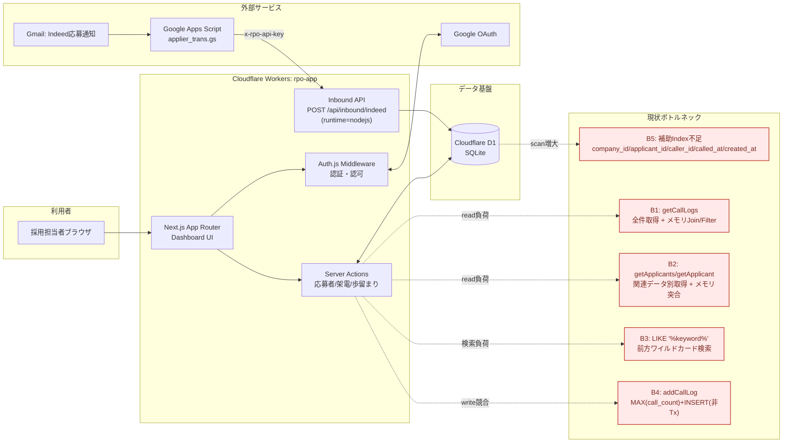

# RPOアプリ システム構成図

## 全体構成（現状ボトルネックを含む）

## ボトルネック詳細
| ID | 該当処理 | 現状 | 影響 |
|---|---|---|---|
| B1 | `getCallLogs` | `call_log` 全件 + `applicant/company/user` 全件を取得し、アプリ側で突合・フィルタ | データ増加時にレスポンス悪化（CPU/メモリ/転送量増） |
| B2 | `getApplicants`, `getApplicant` | JOINを使わず別クエリ＋`find`で突合 | 一覧・詳細ともに読取効率が落ちる |
| B3 | 応募者検索・企業名正規化検索 | `LIKE '%keyword%'` と `lower(trim(name))` 比較が中心 | indexが効きにくく、フルスキャン傾向 |
| B4 | 架電ログ登録 | `MAX(call_count)` 取得後に `INSERT`（トランザクション境界なし） | 同時書き込みで競合・採番重複リスク |
| B5 | D1物理設計 | FK/絞り込み/ソート列の補助indexが不足 | 一覧・集計・検索でスキャンコスト増 |

## 補足
- 現在の主経路は「ブラウザ -> Server Actions -> D1」と「Gmail -> GAS -> Inbound API -> D1」の2系統です。
- ボトルネックはコード構造に基づく現状分析であり、実運用ではアクセス量・件数に応じて顕在化します。
